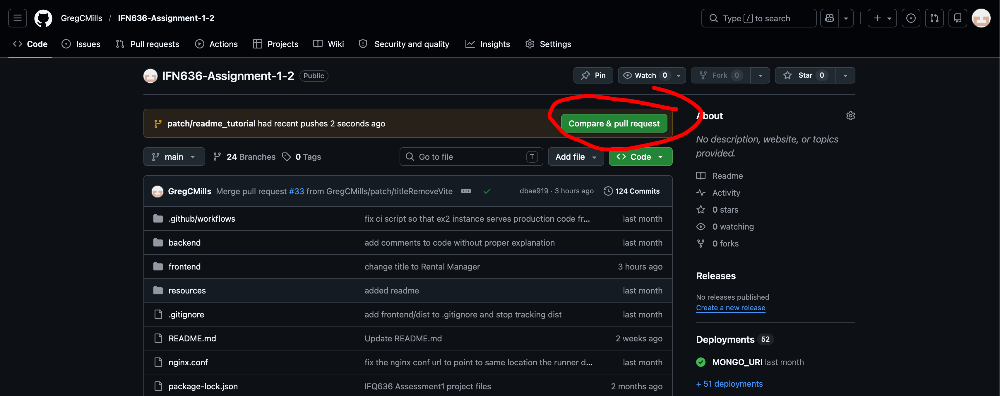
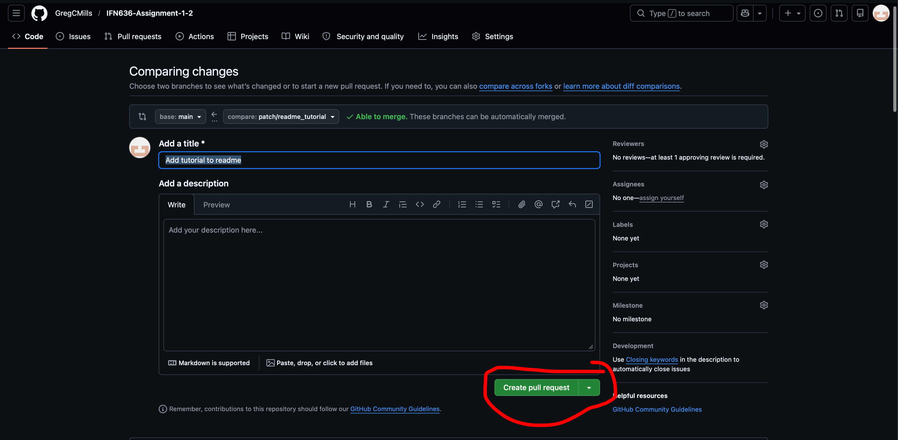
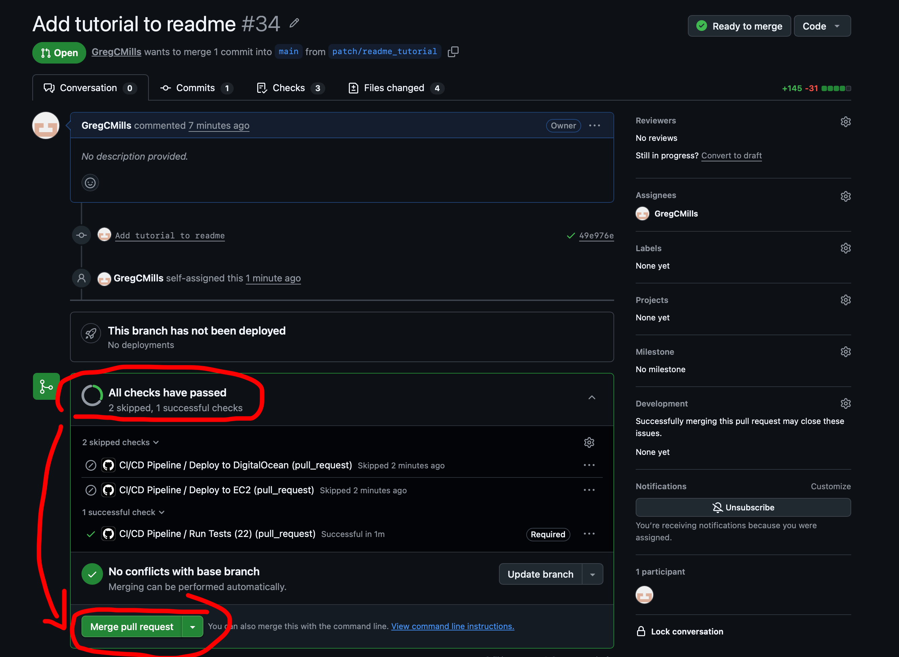
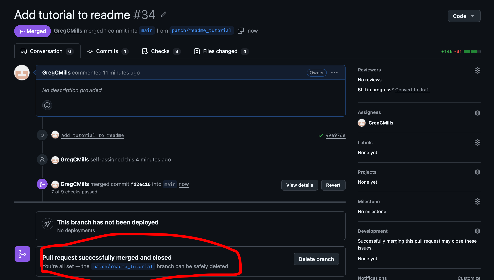
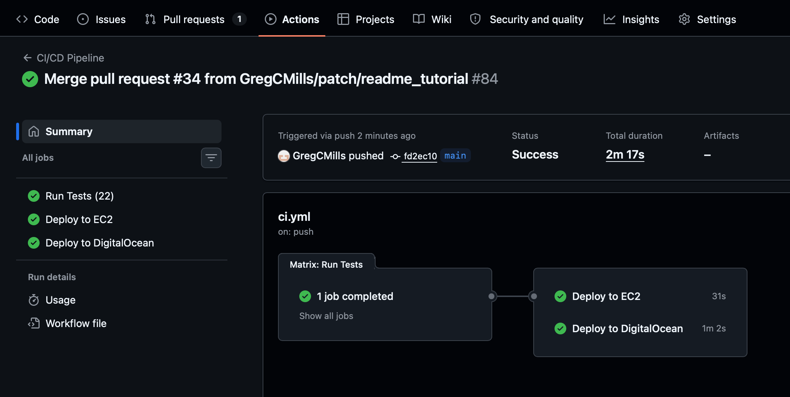

# Links

**EC2 Public URL:** [http://54.206.192.58](http://54.206.192.58)
*note, as of 06/04/2026 the EC2 instance was already automatically shut down. I restarted it to: [http://13.239.114.254](http://13.239.114.254)

**Alternate Public URL:** [http://gregmills.xyz](http://gregmills.xyz)

# Users

To sign in to the application as a customer, you can use this example account:

## Jane Doe - Customer

**Username/email:** [jane@mail.com](mailto:jane@mail.com)

**Password:** password

You can also simply use a google or apple account.

## Randy Doe - Admin

**Username/email:** [randy@mail.com](mailto:randy@mail.com)

**Password:** password

---

# How to use

At any time an admin may access the 'Reset Assets' debug option to reset the database to a static example data with a variety of users and items:


The general flow of the application is thus:

1. The customer or admin logs in (see above)
2. The user browses the catalogue of assets to rent.
  
3. The user adds items to their cart and requests to rent them:
  
4. The admin sees that the user has requested to rent items, and approves them when they see the user has retrieved / paid for the items:
  
5. The user sees that they have rented assets, and when they are finished with them they submit a return request:
  
6. Once the admin has verified that the user has returned them they either approve the item (putting it as available again), mark it for maintenance (if the item is damaged) or reject it (if the user has not actually returned it):
  

---

# Additional Features:

- The admin may create new product groups, product types and specific instances of assets:

- The admin may see an overview of all assets:

- The admin may see all assets marked for maintenance:


---

# Local Setup Instructions

## Prerequisites

Before starting, install:

- Git
- Node.js 22 or newer
- npm, which is included with Node.js

Clone the repository and install all dependencies from the project root:

```bash
git clone https://github.com/GregCMills/IFN636-Assignment-1-2
cd IFN636-Assignment-1-2
npm run install-all
```

Make sure `npm run install-all` is run from the root folder of the project, not from inside `frontend` or `backend`.

## Environment Variables

This project needs local `.env` files for the frontend and backend. These files store settings such as database connection strings and Clerk authentication keys.

The real `.env` files are ignored by Git, so they are not uploaded to GitHub. Instead, the repository includes `.env_template` files that you can copy.

## Frontend `.env`

In the `frontend` folder, copy `.env_template` and rename the copy to `.env`.

The frontend `.env` file contains:

```env
VITE_CLERK_PUBLISHABLE_KEY=...
```

This is Clerk's publishable key. It is safe to include in the repository because it is public and is used by the browser to connect to the correct Clerk project.

## Backend `.env`

In the `backend` folder, copy `.env_template` and rename the copy to `.env`.

The backend `.env` file contains:

```env
MONGO_URI=...
TEST_MONGO_URI=...
CLERK_SECRET_KEY=...
CLERK_PUBLISHABLE_KEY=...
PORT=5001
```

`MONGO_URI` is the MongoDB database used when running the application locally.

`TEST_MONGO_URI` is the MongoDB database used when running tests. This should be a separate database so test data does not pollute the normal development database.

`CLERK_SECRET_KEY` is the private Clerk key used by the backend. This key should not be committed to GitHub. I will share it privately, and you should paste it into your local `backend/.env` file.

`CLERK_PUBLISHABLE_KEY` is the public Clerk key used by the backend to identify the correct Clerk project. You can leave this as it appears in the template.

`PORT` controls which port the backend runs on. Leave this as `5001`.

## Running Tests

To run all tests for both the backend and frontend, run this from the project root:

```bash
npm run test
```

The backend tests will use `TEST_MONGO_URI`, so make sure that value is set before running tests.

## Running The App Locally

To start the application locally, run this from the project root:

```bash
npm run dev
```

This starts both the backend and frontend.

The frontend will run locally in your browser, and the backend will connect to the MongoDB database set in `MONGO_URI`.

---

# Making Changes And Deploying

The `main` branch is protected, so do not commit directly to `main`.

When you want to make a change, create a new branch first:

```bash
git switch -c your-branch-name
```

Make your changes, then commit them:

```bash
git add .
git commit -m "Describe your change"
```

Make sure to test your changes before pushing using:

```bash
npm run test
```

Push your branch to GitHub:

```bash
git push -u origin your-branch-name
```

After pushing your branch, go to the GitHub website and open a pull request from your branch into `main`. This lets you check what your request will actually do and have a looksee.


If you're happy, make a 'pull request'. This is requesting that your branch be 'pulled' into the main code. Essentially, because we are a group of three, you are requesting to the other two group members.


## Pull Request Checks

When a pull request is opened against `main`, GitHub Actions automatically runs the CI/CD workflow.

For pull requests, the workflow:

- installs the backend dependencies
- runs the backend tests
- installs the frontend dependencies
- runs the frontend typecheck
- runs the frontend tests

## Merging To `main`

After the pull request has passing tests, merge it into `main` using the GitHub website.





Merging to `main` triggers the GitHub Actions workflow again. This time, the workflow runs the tests again and then deploys the application if the tests pass.

On a successful merge to `main`, the workflow deploys to:

- Greg's EC2 server
- Greg's DigitalOcean droplet, this is what is at gregmills.xyz



This means every deployment should come from a reviewed pull request with passing tests.
