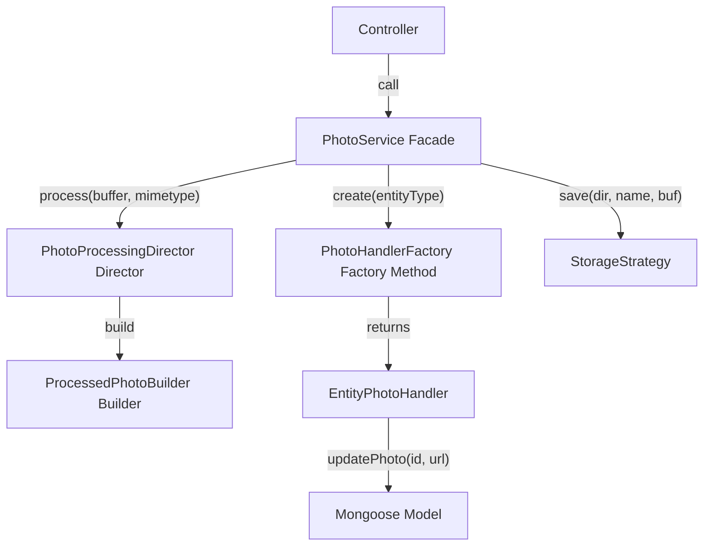
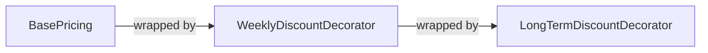

# Backend Design Patterns

This report identifies and analyses software design patterns from the
[Refactoring.Guru catalog](https://refactoring.guru/design-patterns/catalog)
that appear in the backend of this project. The backend is a TypeScript /
Express 5 / Mongoose / Clerk application that manages an equipment rental
system.

Each pattern is classified as either **Confirmed** (a clear, textbook-like
implementation) or **Partial** (the spirit is present, but some elements differ
from the canonical form). For partial matches the report describes what is
missing and what would be required to elevate the code to a full
implementation.

---

## Pattern Summary

| # | Pattern | Category | Status | Key Files |
|---|---------|----------|--------|-----------|
| 1 | [Singleton](#1-singleton) | Creational | Confirmed | `server.ts`, `models/*.ts`, `config/db.ts`, `services/auth/ClerkAuthAdapter.ts`, `services/photo/PhotoService.ts`, `services/entity/EntityService.ts`, `services/rental-history/RentalHistoryObserver.ts` |
| 2 | [Facade](#2-facade) | Structural | Confirmed | `server.ts`, `controllers/assetController.ts`, `services/photo/PhotoService.ts`, `services/entity/EntityService.ts` |
| 3 | [Adapter](#3-adapter) | Structural | Confirmed | `services/auth/AuthAdapter.ts`, `services/auth/ClerkAuthAdapter.ts`, `models/*.ts` |
| 4 | [Decorator](#4-decorator) | Structural | Confirmed | `services/auth/ClerkAuthAdapter.ts`, `routes/*.ts`, `server.ts`, `services/pricing/PricingStrategy.ts` |
| 5 | [Chain of Responsibility](#5-chain-of-responsibility) | Behavioral | Confirmed | `services/auth/ClerkAuthAdapter.ts`, `routes/*.ts`, `services/errors/AppError.ts`, `middleware/uploadMiddleware.ts`, `server.ts` |
| 6 | [Template Method](#6-template-method) | Behavioral | Confirmed | `services/asset-states/AssetState.ts`, `services/inventory/InventoryComponent.ts` |
| 7 | [State](#7-state) | Behavioral | Confirmed | `services/asset-states/*.ts` |
| 8 | [Strategy](#8-strategy) | Behavioral | Confirmed | `services/asset-states/TransitionAuthoriser.ts`, `services/photo/storage/*.ts` |
| 9 | [Composite](#9-composite) | Structural | Confirmed | `services/inventory/*.ts` |
| 10 | [Factory Method](#10-factory-method) | Creational | Confirmed | `services/photo/handlers/*.ts` |
| 11 | [Builder](#11-builder) | Creational | Confirmed | `services/photo/ProcessedPhotoBuilder.ts`, `services/photo/PhotoProcessingDirector.ts` |
| 12 | [Observer](#12-observer) | Behavioral | Confirmed | `services/rental-history/RentalHistoryObserver.ts` |

---

## 1. Singleton

**Category:** Creational

**Refactoring.Guru definition:**
> Singleton is a creational design pattern that lets you ensure that a class
> has only one instance, while providing a global access point to this instance.

### How it appears in this codebase

Node.js modules are singletons by default. When a module is imported for the
first time its top-level code runs once; the result is cached and the same
object is returned on every subsequent import. The backend relies on this
mechanism in several places.

#### 1a. The Express application (`server.ts`)

```ts
const app = express();
```

`app` is created once at module scope. Every other module that imports
`server.ts` (e.g. the test suite) receives the exact same Express instance. The
module uses a `require.main === module` guard so the server only starts
listening when run directly, not when imported by tests.

#### 1b. Mongoose models (`models/*.ts`)

```ts
export default model<IRentalHistory>('RentalHistory', rentalHistorySchema);
```

`model()` registers the model name on the global Mongoose connection.
Subsequent calls with the same name return the existing compiled model. Each
model file is evaluated only once by Node's module cache, so every controller
that imports a model receives the same model constructor.

This applies to all five models:

- `models/Asset.ts` — `Asset`
- `models/AssetType.ts` — `AssetType`
- `models/ProductGroup.ts` — `ProductGroup`
- `models/User.ts` — `User`
- `models/RentalHistory.ts` — `RentalHistory`

#### 1c. The database connection (`config/db.ts`)

The `connectDB` function is created once and shared across `server.ts` and the
test setup. The underlying Mongoose connection it establishes is also a
singleton — Mongoose maintains a single default connection object.

#### 1d. The auth adapter (`services/auth/ClerkAuthAdapter.ts`)

```ts
export default new ClerkAuthAdapter();
```

The authentication adapter is exported as a singleton instance. Every file that
imports `ClerkAuthAdapter` receives the exact same object — controllers, route
files, and `server.ts` all share one adapter.

#### 1e. State singletons (`services/asset-states/AssetStateMachine.ts`)

```ts
const STATE_MAP = {
  'Available':       new AvailableState(),
  'Pending Rental':  new PendingRentalState(),
  'Rented':          new RentedState(),
  'Pending Return':  new PendingReturnState(),
  'Maintenance':     new MaintenanceState(),
};
```

The five concrete state objects are instantiated once inside `AssetStateMachine`
and shared across all requests.

#### 1f. The photo service (`services/photo/PhotoService.ts`)

```ts
export default new PhotoService();
```

The `PhotoService` is exported as a singleton instance (same pattern as
`ClerkAuthAdapter`). Every module that imports `PhotoService` receives the same
object — controllers, route files, and the Composite delete method all share
one `PhotoService` (and therefore one `StorageStrategy`).

#### 1g. The entity service (`services/entity/EntityService.ts`)

```ts
export default new EntityService();
```

The `EntityService` is exported as a singleton instance (same pattern as
`PhotoService`). The controller imports it and delegates `updateEntity()` calls
to the shared instance.

#### 1h. The rental completion subject (`services/rental-history/RentalHistoryObserver.ts`)

```ts
export const rentalCompletionSubject = new RentalCompletionSubject();
rentalCompletionSubject.subscribe(new MongoRentalHistoryRecorder());
```

The `RentalCompletionSubject` singleton is created at module scope and
immediately subscribed with a `MongoRentalHistoryRecorder`. The controller
imports this one subject and calls `notify()` to broadcast rental completion
events to all subscribed observers.

#### 1i. Photo handler instances (`services/photo/handlers/PhotoHandlerFactory.ts`)

```ts
const handlers: Record<string, EntityPhotoHandler> = {
  group: new GroupPhotoHandler(),
  type:  new TypePhotoHandler(),
  asset: new AssetPhotoHandler(),
};
```

The three handler instances are created once and cached. `PhotoHandlerFactory`
returns the same handler object on every `create()` call, so all photo
operations share the same three handler singletons.

### Evaluation

Confirmed. The Singleton is achieved through Node.js module caching rather than
the classic private-constructor + `getInstance()` pattern. This is the idiomatic
approach in JavaScript/TypeScript and is fully consistent with the Singleton
intent: one shared instance with a global access point.

---

## 2. Facade

**Category:** Structural

**Refactoring.Guru definition:**
> Facade is a structural design pattern that provides a simplified interface to
> a library, a framework, or any other complex set of classes.

### How it appears in this codebase

#### 2a. Application entry point (`server.ts`)

`server.ts` acts as a facade for the entire backend subsystem. It wires together:

- Environment configuration (`dotenv`)
- Database connection (`config/db.ts`)
- Authentication middleware (`@clerk/express`)
- CORS policy
- JSON body parsing
- Static file serving for uploads
- Four route modules (`authRoutes`, `groupRoutes`, `typeRoutes`, `assetRoutes`)

```ts
app.use(auth.contextMiddleware());
app.use(cors());
app.use(express.json());
app.use('/uploads', express.static(UPLOADS_ROOT));
app.use('/api/auth',   authRoutes);
app.use('/api/groups', groupRoutes);
app.use('/api/types',  typeRoutes);
app.use('/api/assets', assetRoutes);
```

Any external consumer (e.g. the test suite via `supertest`, or Nginx via the
reverse proxy) only needs to import `server.ts` to get a fully configured
application. All internal complexity — middleware ordering, route mounting,
database initialisation — is hidden behind this single file.

#### 2b. Clerk user enrichment (`controllers/assetController.ts`)

The `enrichWithClerkUsers` helper function is a facade over user enrichment:

1. Extracts unique `rentedByUserId` values from raw Mongoose documents.
2. Delegates to `auth.getUsers()` (the auth adapter) for batch user lookup.
3. Receives already-normalised `{ email, name }` objects — no Clerk-specific
   field parsing is needed.
4. Merges the user data back into plain JavaScript objects.

Controller functions simply call `await enrichWithClerkUsers(assets)` without
knowing anything about the underlying auth provider, its API, or its data
format.

#### 2c. Photo service (`services/photo/PhotoService.ts`)

The `PhotoService` is a facade over the photo subsystem. It exposes three
methods — `uploadPhoto()`, `deletePhoto()`, and `getPhotoUrl()` — and hides
behind them the complexity of:

- **Storage strategy** — file system or S3 operations (save/delete/getUrl)
- **Image processing** — resizing and thumbnail generation via `sharp`
- **Entity handlers** — Mongoose model queries for photo URLs per entity type

Controllers call `photoService.uploadPhoto('group', id, req.file)` without
knowing how files are stored, how images are processed, or which Mongoose
model is being updated.

#### 2d. Entity service (`services/entity/EntityService.ts`)

The `EntityService` is a facade over entity data mutations. It exposes a
single method — `updateEntity()` — and hides behind it the complexity of:

- **Model resolution** — mapping entity type strings to Mongoose models
- **Partial updates** — only modifying fields present in the request

Controllers call `entityService.updateEntity('group', id, { name, description })`
without knowing which Mongoose model is being queried or how the update is
persisted.

### Evaluation

Confirmed. Four independent facades coexist: `server.ts` (infrastructure),
`enrichWithClerkUsers` (user data), `PhotoService` (photo operations), and
`EntityService` (entity data mutations). Each hides a different subsystem
behind a simple interface.

---

## 3. Adapter

**Category:** Structural

**Refactoring.Guru definition:**
> Adapter is a structural design pattern that allows objects with incompatible
> interfaces to collaborate.

### How it appears in this codebase

#### 3a. Mongoose `toJSON` transforms

Each model defines a `toJSON` schema option that adapts Mongoose's internal
document representation (which uses `_id`, `__v`, and `ObjectId` objects) into
the clean JSON format expected by the frontend.

```ts
assetSchema.set('toJSON', {
  transform: (_, ret) => {
    ret.id     = ret._id.toString();
    ret.typeId = ret.typeId.toString();
    delete ret._id;
    delete ret.__v;
    return ret;
  },
});
```

The same pattern appears in `AssetType.ts`, `ProductGroup.ts`, and
`RentalHistory.ts`. Without these adapters, the frontend would receive raw
`ObjectId` objects and MongoDB-internal fields. Fields like `name` and
`description` pass through unchanged because they are plain strings.

The `RentalHistory` model's transform is the most comprehensive — it converts
both `assetId` and `typeId` to strings and strips `createdAt`/`updatedAt` in
addition to `_id`/`__v`.

#### 3b. Auth adapter (`services/auth/`)

The `ClerkAuthAdapter` is a comprehensive Adapter over the Clerk authentication
provider. `AuthAdapter` defines the target interface; `ClerkAuthAdapter`
implements it for Clerk:

```ts
abstract class AuthAdapter {
  abstract contextMiddleware(): RequestHandler;
  abstract requireAuth(): RequestHandler;
  abstract adminOnly(): RequestHandler;
  abstract getUserId(req: Request): string | null;
  abstract getUser(userId: string): Promise<NormalisedUser>;
  abstract getUsers(userIds: string[]): Promise<Record<string, NormalisedUser>>;
}
```

The adapter translates three kinds of Clerk coupling:

| Clerk concern | Clerk-specific detail | Adapter method | Consumer sees |
|---------------|----------------------|----------------|---------------|
| Middleware | `clerkMiddleware()` / `requireAuth()` | `contextMiddleware()` / `requireAuth()` | Consistent calling convention |
| Request auth | `req.auth` is a function in v2, object in v1 | `getUserId(req)` | `string \| null` |
| User data | `emailAddresses[0]`, `firstName`/`lastName`, `publicMetadata.role` | `getUser()` / `getUsers()` | `{ id, email, name, role }` |

No consumer outside `ClerkAuthAdapter.ts` imports from `@clerk/express`.
Replacing Clerk with Auth0, Firebase Auth, or any other provider requires only
a new adapter class — zero changes to controllers, routes, or business logic.

### Files

| File | Role |
|------|------|
| `services/auth/AuthAdapter.ts` | Base class — defines the adapter interface |
| `services/auth/ClerkAuthAdapter.ts` | Concrete adapter — translates Clerk API calls |

### Evaluation

Confirmed. Textbook Adapter implementations. The `toJSON` transforms run
automatically on every serialisation. The `ClerkAuthAdapter` absorbs all
Clerk-specific code into a single file — all other modules import the adapter
singleton and never see Clerk internals.

---

## 4. Decorator

**Category:** Structural

**Refactoring.Guru definition:**
> Decorator is a structural design pattern that lets you attach new behaviors to
> objects by placing these objects inside special wrapper objects that contain
> the behaviors.

### How it appears in this codebase

The Decorator pattern appears in two independent contexts: Express middleware
wrapping and the pricing calculation chain.

#### 4a. Express middleware — application-level decorators (`server.ts`)

Express middleware is a classic implementation of the Decorator pattern. Each
middleware function wraps the request/response cycle and adds behaviour without
changing the core handler's interface (the `(req, res, next)` signature).

```ts
app.use(auth.contextMiddleware());  // decorates every request with auth context
app.use(cors());                    // decorates every response with CORS headers
app.use(express.json());            // decorates every request with parsed JSON body
```

Each `app.use()` call adds a decorator to the request pipeline. The decorators
are composable and can be reordered independently.

#### 4b. Express middleware — route-level decorators (`routes/*.ts`)

```ts
router.post('/', auth.requireAuth(), auth.adminOnly(), createAsset);
```

Here the base handler (`createAsset`) is decorated with two additional
behaviours:

1. **`auth.requireAuth()`** — verifies the user is authenticated via the auth
   provider. If not, responds with `401` and stops the chain.
2. **`auth.adminOnly()`** — checks `user.role === 'admin'`. If not, responds
   with `403` and stops the chain.

Only after both decorators pass does the request reach the actual controller.
This pattern repeats across all route files.

#### 4c. Pricing decorator chain (`services/pricing/PricingStrategy.ts`)

A second, independent Decorator implementation handles rental cost calculation.
This is a textbook object-oriented Decorator with a concrete component, an
abstract decorator, and two concrete decorators:

**The common interface:**

```ts
export interface PricingStrategy {
  calculate(days: number): number;
  describe(): string;
}
```

**Concrete component — base price:**

```ts
export class BasePricing implements PricingStrategy {
  constructor(private readonly pricePerDay: number) {}
  calculate(days: number): number {
    if (days <= 0) return 0;
    return this.pricePerDay * days;
  }
  describe(): string { return `Base: $${this.pricePerDay}/day`; }
}
```

**Abstract decorator — wraps another `PricingStrategy`:**

```ts
export abstract class PricingDecorator implements PricingStrategy {
  constructor(protected readonly wrapped: PricingStrategy) {}
  abstract calculate(days: number): number;
  abstract describe(): string;
}
```

**Concrete decorators:**

| Decorator | Behaviour | Threshold |
|-----------|-----------|-----------|
| `WeeklyDiscountDecorator` | 10% off | Rentals ≥ 7 days |
| `LongTermDiscountDecorator` | 15% off | Rentals ≥ 30 days |

Each decorator wraps another `PricingStrategy` and applies its discount
conditionally. The `calculate()` method delegates to the wrapped strategy
first, then modifies the result:

```ts
export class WeeklyDiscountDecorator extends PricingDecorator {
  calculate(days: number): number {
    const base = this.wrapped.calculate(days);
    if (days >= 7) return base * 0.90;
    return base;
  }
}
```

**The helper that builds the standard chain:**

```ts
export const buildDefaultPricingChain = (pricePerDay: number): PricingStrategy => {
  return new LongTermDiscountDecorator(
    new WeeklyDiscountDecorator(
      new BasePricing(pricePerDay)
    )
  );
};
```

The decoration order is `LongTerm(Weekly(Base(price)))`. Reading inside-out:
compute base price, then apply weekly discount if eligible, then apply long-term
discount if eligible. Both discounts compose naturally — a 30-day rental gets
both the 10% weekly discount and the 15% long-term discount applied
sequentially.

**Controller integration:**

The `calculateRentalCost` handler in `assetController.ts` uses the decorator
chain:

```ts
const chain   = buildDefaultPricingChain(pricePerDay);
const perUnit = chain.calculate(days);
```

Adding a future pricing rule (e.g. member discount, seasonal pricing, peak
surcharge) means creating one new `PricingDecorator` subclass and inserting it
into the chain — no changes to existing decorators or the controller.

### Evaluation

Confirmed. Two independent Decorator pattern instances coexist:

1. **Express middleware** — one of the most widely recognised real-world uses of
   the Decorator pattern in the JavaScript ecosystem. Each decorator has a
   single responsibility (authentication, authorisation, CORS, body parsing) and
   they compose naturally through the middleware stack.
2. **Pricing chain** — a textbook object-oriented Decorator with a common
   interface, concrete component, abstract decorator, and multiple concrete
   decorators that stack dynamically at runtime.

---

## 5. Chain of Responsibility

**Category:** Behavioral

**Refactoring.Guru definition:**
> Chain of Responsibility is a behavioral design pattern that lets you pass
> requests along a chain of handlers. Upon receiving a request, each handler
> decides either to process the request or to pass it to the next handler in
> the chain.

### How it appears in this codebase

Express middleware also implements the Chain of Responsibility pattern. Each
handler receives the request, performs its work, and calls `next()` to pass
control to the next handler. A handler can **short-circuit** the chain by
sending a response instead of calling `next()`.

#### 5a. The `adminOnly` handler (`services/auth/ClerkAuthAdapter.ts`)

```ts
adminOnly() {
  return async (req, res, next) => {
    try {
      const user = await this.getUser(this.getUserId(req));
      if (user.role !== 'admin') {
        return res.status(403).json({ message: 'Admin access required' });
      }
      next();
    } catch (err) {
      res.status(403).json({ message: 'Admin access required' });
    }
  };
}
```

This is a textbook Chain of Responsibility handler:

- It checks a condition (is the user an admin?).
- If the condition fails, it **handles the request itself** by responding with
  `403` — the chain stops.
- If the condition passes, it calls `next()` to **pass the request along** to
  the next handler.

#### 5b. Per-route handler chains

```ts
router.post('/', auth.requireAuth(), auth.adminOnly(), createAsset);
```

The chain for this route is:

```
auth.requireAuth() → auth.adminOnly() → createAsset
```

1. `auth.requireAuth()` checks authentication. Unauthenticated → `401`, chain
   stops.
2. `auth.adminOnly()` checks authorisation. Non-admin → `403`, chain stops.
3. `createAsset` is the terminal handler — it processes the business logic.

#### 5c. Error hierarchy as an extension of the chain (`services/errors/AppError.ts`)

The custom error class hierarchy (`AppError`, `ValidationError`, `NotFoundError`,
`AuthorisationError`, `AuthenticationError`) extends the Chain of Responsibility
by enriching the terminal error handler in `server.ts`.

Each error class carries its own `statusCode`:

```ts
class AppError extends Error {
  constructor(message: string, statusCode = 500) {
    super(message);
    this.statusCode = statusCode;
  }
}
class ValidationError    extends AppError { constructor(m) { super(m, 400); } }
class NotFoundError       extends AppError { constructor(m) { super(m, 404); } }
class AuthorisationError  extends AppError { constructor(m) { super(m, 403); } }
class AuthenticationError extends AppError { constructor(m) { super(m, 401); } }
```

Controllers throw typed errors (`throw new NotFoundError('Asset not found')`)
instead of calling `res.status(404).json(...)`. Express 5 catches the thrown
error and passes it to the global error-handling middleware — the **terminal
handler** in the chain:

```ts
app.use((err, req, res, next) => {
  const status = err instanceof AppError ? err.statusCode : 500;
  const message = status < 500 ? err.message : 'Internal server error';
  res.status(status).json({ message });
});
```

Key design decisions:

- **AppError subclasses** (400/401/403/404): the message is user-facing and
  shown to the client.
- **Unexpected errors** (500): the raw message is hidden and replaced with
  "Internal server error" to prevent information leakage (stack traces, DB
  connection strings, etc.).
- **Non-AppError throws** (e.g. Mongoose validation, network errors): treated
  as 500, message hidden — same safety guarantee.

This pattern separates HTTP concerns from business logic. Controllers express
error conditions declaratively (`throw new NotFoundError(...)`) and the global
handler translates error types into HTTP responses in one place.

Entity update routes follow the identical `auth.requireAuth()`,
`auth.adminOnly()` sequence before reaching the controller:

```ts
router.patch('/:id', auth.requireAuth(), auth.adminOnly(), updateEntity('group'));
```

The full chain for an entity update:

```
auth.requireAuth() → auth.adminOnly() → updateEntity
```

1. `auth.requireAuth()` — checks authentication (401 if unauthenticated).
2. `auth.adminOnly()` — checks admin role (403 if not admin).
3. `updateEntity('group')` — the terminal handler: validates input and updates
   the entity via EntityService.

All three entity types (groups, types, assets) share the same chain structure,
differing only in the entity type string passed to the controller factory.

#### 5d. Upload validation chain (`middleware/uploadMiddleware.ts`)

Photo upload routes add two new links to the middleware chain:

```ts
router.post('/:id/photo', auth.requireAuth(), auth.adminOnly(),
            upload.single('photo'), validateFileType, uploadPhoto('group'));
```

The full chain for a photo upload:

```
auth.requireAuth() → auth.adminOnly() → multer.single('photo') → validateFileType → uploadPhoto
```

1. `auth.requireAuth()` — checks authentication (401 if unauthenticated).
2. `auth.adminOnly()` — checks admin role (403 if not admin).
3. `multer.single('photo')` — parses multipart data; enforces 5MB file size
   limit. Multer errors (e.g. file too large) are caught by Express 5 and
   forwarded to the global error handler.
4. `validateFileType` — checks MIME type is `image/jpeg`, `image/png`, or
   `image/webp`. Throws `ValidationError` (400) if not. This matches the project
   convention of throwing typed `AppError` subclasses rather than calling
   `res.status().json()` directly.
5. `uploadPhoto('group')` — the terminal handler: processes and saves the photo.

### Relationship to Decorator

Express middleware simultaneously implements both Decorator and Chain of
Responsibility. The distinction depends on perspective:

- As a **Decorator**, each middleware *adds* behaviour (auth context, CORS
  headers, parsed bodies) while preserving the `(req, res, next)` interface.
- As a **Chain of Responsibility**, each middleware *decides* whether to handle
  the request or pass it along. The `auth.adminOnly()` middleware is a
  particularly clear example because it explicitly short-circuits the chain.

### Evaluation

Confirmed. The pattern is used consistently across all route definitions, and
the separation between authentication (`auth.requireAuth()`) and authorisation
(`auth.adminOnly()`) into distinct chain links follows best practice.

---

## 6. Template Method

**Category:** Behavioral

**Refactoring.Guru definition:**
> Template Method is a behavioral design pattern that defines the skeleton of
> an algorithm in the superclass but lets subclasses override specific steps of
> the algorithm without changing its structure.

### How it appears in this codebase

#### 6a. `AssetState` base class (`services/asset-states/AssetState.ts`)

The `AssetState` base class defines the `canTransitionTo()` algorithm skeleton:

```ts
abstract class AssetState {
  abstract getName(): string;
  getValidTransitions(): string[]          { return []; }
  canTransitionTo(newStatus: string): boolean { return this.getValidTransitions().includes(newStatus); }
  shouldClearRentalData(newStatus: string): boolean { return false; }
}
```

`canTransitionTo()` is the **template method** — it defines the algorithm
structure (check if the target status is in the list of valid transitions) and
calls the **primitive operation** `getValidTransitions()`, which each concrete
state class overrides:

| State class | `getValidTransitions()` override |
|---|---|
| `AvailableState` | `['Pending Rental', 'Maintenance']` |
| `PendingRentalState` | `['Rented', 'Available']` |
| `RentedState` | `['Pending Return', 'Maintenance']` |
| `PendingReturnState` | `['Available', 'Rented', 'Maintenance']` |
| `MaintenanceState` | `['Available']` |

Similarly, `shouldClearRentalData()` defaults to `false` in the base class, but
`PendingRentalState` and `PendingReturnState` override it to return `true` for
specific transitions — another primitive operation in the template.

#### 6b. `InventoryComponent` base class (`services/inventory/InventoryComponent.ts`)

The `InventoryComponent` base class provides Template Methods for the two
core Composite operations:

```ts
abstract class InventoryComponent {
  abstract getId(): string;
  abstract getName(): string;
  getChildren(): InventoryComponent[]             { return []; }        // leaf-safe default

  _collectOwnPhotoPaths(): string[]               { /* imageUrl + thumbnailUrl */ }
  async _deleteOwnPhotos(storageStrategy): Promise<void> { /* ... */ }

  getPhotoPaths(): string[]          { /* calls _collectOwnPhotoPaths → recurses via getChildren() */ }
  async delete(storageStrategy): Promise<void> { /* recurses via getChildren() → _deleteOwnPhotos → _deleteSelf */ }

  abstract _deleteSelf(): Promise<void>;
}
```

`getPhotoPaths()` and `delete()` are **Template Methods** — they define the
algorithm skeleton (collect own data → recurse into children for composites,
skip for leaves) and call the primitive operations `getChildren()` and
`_deleteSelf()`. Each concrete subclass overrides only `_deleteSelf()`:

| Subclass | `_deleteSelf()` override |
|---|---|
| `ProductGroupComponent` | `ProductGroup.findByIdAndDelete(this.doc._id)` |
| `AssetTypeComponent` | `AssetType.findByIdAndDelete(this.doc._id)` |
| `AssetComponent` | `Asset.findByIdAndDelete(this.doc._id)` |

Each subclass has only ~6 lines of unique code (constructor + accessors +
`_deleteSelf()`). The common algorithm lives in the base class.

Similarly, `getChildren()` returns an empty array by default, so `AssetComponent`
(the leaf) inherits the full Template Method behaviour without overriding
anything. The leaf's `getPhotoPaths()` collects only its own photos (empty
children loop), and `delete()` skips the children loop and goes straight to
photo cleanup and self-deletion — correct leaf behaviour by default.

### Evaluation

Confirmed. Both `AssetState.canTransitionTo()` and `InventoryComponent.getPhotoPaths()` /
`InventoryComponent.delete()` are textbook Template Methods: the algorithm skeleton
lives in the superclass and subclasses provide the varying step via
`getValidTransitions()` and `_deleteSelf()` respectively. The refactor eliminated
~50 lines of duplicated code across the three Composite subclasses.

---

## 7. State

**Category:** Behavioral

**Refactoring.Guru definition:**
> State is a behavioral design pattern that lets an object alter its behavior
> when its internal state changes. It appears as if the object changed its
> class.

### How it appears in this codebase

The State pattern is implemented with one class per asset status, a context
class that delegates to the current state, and singletons for each state object.

#### 7a. The State interface (`AssetState`)

The base class defines the State contract (see [§6a](#6a-assetstate-base-class)):
`getName()`, `getValidTransitions()`, `canTransitionTo()`, and
`shouldClearRentalData()`.

#### 7b. Concrete State classes (five)

| File | Class | Valid transitions from this state |
|------|-------|----------------------------------|
| `AvailableState.ts` | `AvailableState` | → Pending Rental, Maintenance |
| `PendingRentalState.ts` | `PendingRentalState` | → Rented, Available |
| `RentedState.ts` | `RentedState` | → Pending Return, Maintenance |
| `PendingReturnState.ts` | `PendingReturnState` | → Available, Rented, Maintenance |
| `MaintenanceState.ts` | `MaintenanceState` | → Available |

Each state also defines `shouldClearRentalData()` to indicate whether rental
metadata should be cleared when transitioning to a given target state. For
example, `PendingReturnState` clears rental data when transitioning to
`Available` or `Maintenance`, but not when going to `Rented`.

#### 7c. The Context (`AssetStateMachine`)

```ts
class AssetStateMachine {
  constructor(currentStatus: string) {
    const state = STATE_MAP[currentStatus];
    if (!state) throw new Error(`Unknown status: ${currentStatus}`);
    this._state = state;
  }

  canTransitionTo(newStatus: string, authoriser: TransitionAuthoriser) { /* delegates to state + authoriser */ }
  getValidTransitions(): string[]                   { return this._state.getValidTransitions(); }
  shouldClearRentalData(newStatus: string): boolean  { return this._state.shouldClearRentalData(newStatus); }
}
```

The context wraps the current status string and delegates all behaviour to the
appropriate state singleton. The `STATE_MAP` (see [§1e](#1e-state-singletons-servicesasset-statesassetstatemachinets))
maps each status string to its singleton state object.

#### 7d. State machine transitions

```
Available ────────→ Pending Rental ──→ Rented ──→ Pending Return ──→ Available
    │                      │              │              │
    └──→ Maintenance        └──→ Available └──→ Maintenance └──→ Rented
                                                                  └──→ Maintenance
                                                  Maintenance ──→ Available
```

#### 7e. Controller integration

The controller (`assetController.ts`) integrates the State pattern in the
`bulkUpdateStatus` handler for two purposes:

**Transition validation:**

```ts
const assets = await Asset.find({ _id: { $in: ids } });

for (const asset of assets) {
  const machine = new AssetStateMachine(asset.status);
  if (!machine.canTransitionTo(status, authoriser)) {
    throw new AuthorisationError(
      `Not authorised to transition "${asset.name}" from ${asset.status} to ${status}`
    );
  }
}
```

**Rental data clearing (state-machine-driven):**

```ts
let shouldClear;
if (clearRentalData !== undefined) {
  shouldClear = clearRentalData === true;
} else {
  const machine = new AssetStateMachine(assets[0].status);
  shouldClear = machine.shouldClearRentalData(status);
}
```

The `shouldClearRentalData()` method is wired into the controller as a default.
If the client sends an explicit `clearRentalData` flag, that value takes
precedence. Otherwise, the state machine's encapsulated knowledge of transition
side effects determines whether rental data is cleared. For example,
`PendingReturnState → Available` automatically clears `rentedByUserId`,
`rentedAt`, `returnDate`, and `extensionRequestedReturnDate` without the client
needing to specify it.

### Why State

Before this refactoring, asset status management used a string enum and inline
conditional logic in the controller. There was **no validation of valid
transitions** — an asset could be set from any status to any other status.

The State pattern replaces that with:

1. **One class per state** — each knows what transitions are valid from itself.
2. **Context delegation** — `AssetStateMachine` wraps the status and delegates.
3. **Self-documenting** — the full lifecycle is visible from the class
   hierarchy alone.
4. **Encapsulated side effects** — states define when rental data should be
   cleared.

### Evaluation

Confirmed. The implementation satisfies all three textbook requirements:

1. **State interface** (`AssetState`) declaring state-specific methods.
2. **Concrete State classes** (five) implementing state-specific behaviour.
3. **Context** (`AssetStateMachine`) holding a reference to the current state
   and delegating behaviour to it.

---

## 8. Strategy

**Category:** Behavioral

**Refactoring.Guru definition:**
> Strategy is a behavioral design pattern that lets you define a family of
> algorithms, put each of them into a separate class, and make their objects
> interchangeable.

### How it appears in this codebase

#### 8a. The Strategy interface (`TransitionAuthoriser`)

```ts
export interface TransitionAuthoriser {
  canTransition(currentStatus: string, newStatus: string): boolean;
  verifyOwnership(asset: any, userId: string): boolean;
}
```

#### 8b. Concrete strategies

| Class | `canTransition()` | `verifyOwnership()` |
|-------|-------------------|---------------------|
| `AdminAuthoriser` | Always `true` | Always `true` |
| `CustomerAuthoriser` | `true` only for `Rented` and `Pending Return` | `true` only if `asset.rentedByUserId === userId` |

#### 8c. Runtime selection

The controller selects an authorisation strategy at runtime based on the user's
role:

```ts
const authoriser = isAdmin ? new AdminAuthoriser() : new CustomerAuthoriser();
```

Then calls the uniform interface:

```ts
if (!machine.canTransitionTo(status, authoriser)) { /* reject */ }
if (!authoriser.verifyOwnership(asset, userId))   { /* reject */ }
```

Adding a future role (e.g. "manager") means creating one new class — no
controller or state class changes needed.

### Relationship with State

The Strategy and State patterns work together in a three-phase validation:

1. **State** (structural): "Is Available → Rented a valid transition?" → No.
   Reject.
2. **Strategy** (authorisational): "Does this user's role permit setting
   Maintenance?" → Customer: No. Reject.
3. **Strategy** (ownership): "Does this user own the asset?" → Customer, wrong
   user: No. Reject.

All three must pass for the transition to be permitted.

#### 8d. Photo storage strategy (`services/photo/storage/*.ts`)

A second, independent Strategy instance handles file storage for photos:

```ts
abstract class StorageStrategy {
  abstract save(directory: string, filename: string, buffer: Buffer): Promise<string>;
  abstract delete(relativePath: string | null): Promise<void>;
  abstract getUrl(relativePath: string): string;
}
```

| Class | `save()` | `delete()` | `getUrl()` |
|-------|----------|------------|------------|
| `LocalStorageStrategy` | Writes to `backend/uploads/<dir>/<file>` | Deletes from local filesystem | Returns URL path unchanged |
| `S3StorageStrategy` | Uploads to Amazon S3 bucket | Deletes from S3 bucket | Returns S3 public URL |

The `PhotoService` (Facade) holds a reference to a `StorageStrategy` instance
and delegates all file I/O through it. The strategy is selected once at
construction time based on the `PHOTO_STORAGE` environment variable — `'s3'`
selects `S3StorageStrategy`, anything else falls back to `LocalStorageStrategy`:

```ts
constructor() {
  const useS3 = process.env.PHOTO_STORAGE === 's3';
  this.storageStrategy = useS3 ? new S3StorageStrategy() : new LocalStorageStrategy();
}
```

The same `StorageStrategy` instance is also passed to the Composite's
`delete(storageStrategy)` method. The `InventoryComponent._deleteOwnPhotos()`
helper calls `storageStrategy.delete(url)` for each photo file — the Composite
doesn't know or care which backend it's deleting from.

`S3StorageStrategy` lazy-loads the `@aws-sdk/client-s3` package at construction
time, so the AWS SDK is only required when `PHOTO_STORAGE=s3` is set. It handles
key normalisation (stripping leading slashes, `uploads/` prefix) and URL
encoding for S3 object keys.

In tests, a mock strategy can be substituted to avoid filesystem or S3
side-effects.

### Evaluation

Confirmed. Two independent Strategy pattern instances coexist in the codebase:
`TransitionAuthoriser` for state transitions and `StorageStrategy` for file
storage (with two concrete implementations: local filesystem and S3). Both
follow the textbook structure: a family of interchangeable algorithms behind a
common interface, selected at runtime by the client.

---

## 9. Composite

**Category:** Structural

**Refactoring.Guru definition:**
> Composite is a structural design pattern that lets you compose objects into
> tree structures and then work with these structures as if they were individual
> objects.

### How it appears in this codebase

The Composite pattern is implemented as wrapper classes that sit alongside the
Mongoose models, providing a uniform interface over the three-level entity
hierarchy:

```
ProductGroupComponent  →  AssetTypeComponent  →  AssetComponent
    (composite)               (composite)           (leaf)
```

#### 9a. The Component interface (`InventoryComponent`)

All three entity wrappers implement the same interface:

```ts
abstract class InventoryComponent {
  abstract getId(): string;
  abstract getName(): string;
  getChildren(): InventoryComponent[]      { return []; }  // leaf-safe default
  getPhotoPaths(): string[]                { /* template method */ }
  async delete(storageStrategy): Promise<void> { /* template method */ }
}
```

#### 9b. The leaf: `AssetComponent`

```ts
class AssetComponent extends InventoryComponent {
  getChildren(): InventoryComponent[] { return []; }  // leaf: no children

  async delete(storageStrategy) {
    if (storageStrategy) {
      if (this.doc.imageUrl)     await storageStrategy.delete(this.doc.imageUrl);
      if (this.doc.thumbnailUrl) await storageStrategy.delete(this.doc.thumbnailUrl);
    }
    await Asset.findByIdAndDelete(this.doc._id);
  }
}
```

#### 9c. The composites: `AssetTypeComponent` and `ProductGroupComponent`

Both hold arrays of child `InventoryComponent` objects and delegate
operations recursively:

```ts
class AssetTypeComponent extends InventoryComponent {
  getChildren(): InventoryComponent[] { return this.children; }

  getPhotoPaths(): string[] {
    const paths = [];
    if (this.doc.imageUrl)     paths.push(this.doc.imageUrl);
    if (this.doc.thumbnailUrl) paths.push(this.doc.thumbnailUrl);
    for (const child of this.children) paths.push(...child.getPhotoPaths());
    return paths;
  }

  async delete(storageStrategy) {
    for (const child of this.children) await child.delete(storageStrategy);  // recurse first
    if (storageStrategy) {
      if (this.doc.imageUrl)     await storageStrategy.delete(this.doc.imageUrl);
      if (this.doc.thumbnailUrl) await storageStrategy.delete(this.doc.thumbnailUrl);
    }
    await AssetType.findByIdAndDelete(this.doc._id);
  }
}
```

#### 9d. The tree builder (`InventoryTreeBuilder`)

A stateless factory class assembles composite trees from MongoDB:

```ts
class InventoryTreeBuilder {
  static async fromGroupId(groupId)  → ProductGroupComponent  // full subtree
  static async fromTypeId(typeId)    → AssetTypeComponent      // full subtree
  static async fromAssetId(assetId)  → AssetComponent          // leaf only
}
```

#### 9e. Client code — the controllers

All three delete handlers follow the **same** pattern:

```ts
const root = await InventoryTreeBuilder.fromGroupId(req.params.id);
if (!root) throw new NotFoundError('Group not found');
await root.delete((photoService as any).storageStrategy);
res.json({ success: true });
```

Client code treats all levels uniformly — `build tree → call delete()` — with
no knowledge of the tree depth or composition.

### Evaluation

Confirmed. The implementation satisfies all four textbook requirements:

1. **Common `InventoryComponent` interface** declared in the base class and
   implemented by all three subclasses.
2. **`AssetComponent` is a leaf** — `getChildren()` returns `[]`.
3. **`AssetTypeComponent` and `ProductGroupComponent` are composites** — they
   hold arrays of child `InventoryComponent` objects.
4. **Operations delegate recursively** — `getPhotoPaths()` and `delete()`
   cascade through the entire subtree.

---

## 10. Factory Method

**Category:** Creational

**Refactoring.Guru definition:**
> Factory Method is a creational design pattern that provides an interface for
> creating objects in a superclass, but allows subclasses to alter the type of
> objects that will be created.

### How it appears in this codebase

#### 10a. Entity photo handlers (`services/photo/handlers/*.ts`)

The photo subsystem introduces a textbook Factory Method structure:

```ts
abstract class EntityPhotoHandler {
  abstract get model(): Model<any>;
  abstract get subdirectory(): string;
  async findById(id)                      { return this.model.findById(id); }
  async updatePhoto(id, imageUrl, thumbnailUrl) { /* ... */ }
  async getPhotoPaths(id)                 { /* ... */ }
  async deleteEntityPhotoFiles(id, storageStrategy) { /* ... */ }
}
```

Three concrete subclasses override only the `model` and `subdirectory` getters:

| Subclass | `model` | `subdirectory` | File |
|---|---------|---------------|------|
| `GroupPhotoHandler` | `ProductGroup` | `'groups'` | `handlers/GroupPhotoHandler.ts` |
| `TypePhotoHandler` | `AssetType` | `'types'` | `handlers/TypePhotoHandler.ts` |
| `AssetPhotoHandler` | `Asset` | `'assets'` | `handlers/AssetPhotoHandler.ts` |

The factory (`PhotoHandlerFactory`) creates and caches the correct handler based
on a type string:

```ts
const handlers: Record<string, EntityPhotoHandler> = {
  group: new GroupPhotoHandler(),
  type:  new TypePhotoHandler(),
  asset: new AssetPhotoHandler(),
};

class PhotoHandlerFactory {
  static create(entityType: 'group' | 'type' | 'asset'): EntityPhotoHandler {
    const handler = handlers[entityType];
    if (!handler) throw new Error(`Unknown entity type: ${entityType}`);
    return handler;
  }
}
```

Client code (the `PhotoService` facade) works through the base
`EntityPhotoHandler` interface without knowing which concrete handler it
received:

```ts
const handler = PhotoHandlerFactory.create(entityType);
await handler.deleteEntityPhotoFiles(entityId, this.storageStrategy);
await handler.updatePhoto(entityId, imageUrl, thumbnailUrl);
```

### Factory Method structure

This satisfies all three textbook requirements:

1. A **Creator** class (`EntityPhotoHandler`) with a common interface.
2. **Concrete Creators** (three subclasses) that vary the model, directory, and
   query logic.
3. Client code (`PhotoService`) works with products through the base interface,
   not knowing which concrete class it received.

---

## 11. Builder

**Category:** Creational

**Refactoring.Guru definition:**
> Builder is a creational design pattern that lets you construct complex
> objects step by step.

### How it appears in this codebase

Photo processing involves multiple ordered steps (set original, resize, generate
thumbnail, build result). The Builder pattern captures this multi-step
construction, and a Director defines the standard processing sequence.

#### 11a. The Builder (`ProcessedPhotoBuilder`)

```ts
class ProcessedPhotoBuilder {
  setOriginal(buffer, mimetype)       // stores raw upload data
  async resize(maxWidth, maxHeight)   // resizes with sharp
  async generateThumbnail(size)       // creates square thumbnail
  async getResult()                   // returns { originalBuffer, thumbnailBuffer, width, height, mimetype }
}
```

Each step is isolated and testable independently. The builder accumulates state
through method calls and produces the final product via `getResult()`.

#### 11b. The Director (`PhotoProcessingDirector`)

```ts
class PhotoProcessingDirector {
  async process(fileBuffer, mimetype) {
    const builder = new ProcessedPhotoBuilder();
    builder.setOriginal(fileBuffer, mimetype);
    await builder.resize(800, 800);
    await builder.generateThumbnail(200);
    return builder.getResult();
  }
}
```

The Director knows the **order** of steps (resize to 800×800, then 200×200
thumbnail) but doesn't know the implementation details of each step — those are
encapsulated in the Builder.

#### 11c. Why Builder + Director

- The Builder allows future variations without changing the Director (e.g. a
  different Director could skip thumbnails for small icons).
- The Builder can be used standalone for custom processing sequences.
- Each step is isolated and testable independently.

### Product

```ts
{
  originalBuffer:  <Buffer>,    // resized original
  thumbnailBuffer: <Buffer>,    // thumbnail image
  width:           800,         // final width
  height:          600,         // final height
  mimetype:        'image/jpeg',
}
```

### Evaluation

Confirmed. Textbook Builder implementation: the Builder constructs a complex
product step by step, the Director defines the standard sequence, and the
`PhotoService` (client) calls the Director without knowing the construction
details. The pattern is a clean fit for image processing pipelines where each
step (resize, thumbnail, format conversion) is a discrete operation on
accumulated state.

---

## 12. Observer

**Category:** Behavioral

**Refactoring.Guru definition:**
> Observer is a behavioral design pattern that lets you define a subscription
> mechanism to notify multiple objects about any events that happen to the
> object they're observing.

### How it appears in this codebase

The Observer pattern is used to record completed rentals when assets transition
out of the rental lifecycle. This decouples rental history recording from the
status transition logic in the controller.

#### 12a. The Observer interface (`RentalCompletionObserver`)

```ts
export interface RentalCompletionObserver {
  onRentalCompleted(event: RentalCompletionEvent): Promise<void>;
}
```

#### 12b. The Subject (`RentalCompletionSubject`)

```ts
export class RentalCompletionSubject {
  private observers: RentalCompletionObserver[] = [];

  subscribe(observer: RentalCompletionObserver): void {
    this.observers.push(observer);
  }

  async notify(event: RentalCompletionEvent): Promise<void> {
    await Promise.all(this.observers.map(obs => obs.onRentalCompleted(event)));
  }
}
```

The Subject maintains a list of observers and broadcasts events to all of them
via `notify()`. The `Promise.all` ensures all observers are notified
concurrently.

#### 12c. The Concrete Observer (`MongoRentalHistoryRecorder`)

```ts
export class MongoRentalHistoryRecorder implements RentalCompletionObserver {
  async onRentalCompleted(event: RentalCompletionEvent): Promise<void> {
    await RentalHistory.create({
      assetId: event.assetId,
      typeId: event.typeId,
      assetName: event.assetName,
      assetTypeName: event.assetTypeName,
      rentedByUserId: event.rentedByUserId,
      returnDate: event.returnDate,
      finalStatus: event.finalStatus,
      completedAt: new Date().toISOString(),
      ...(event.rentApprovedAt ? { rentApprovedAt: event.rentApprovedAt } : {}),
      ...(event.rentDate ? { rentDate: event.rentDate } : {}),
    });
  }
}
```

The concrete observer persists the rental completion event to MongoDB via the
`RentalHistory` model. It knows nothing about the state machine, the
controller, or how it was triggered — it only knows how to record a completed
rental.

#### 12d. The Event (`RentalCompletionEvent`)

```ts
export interface RentalCompletionEvent {
  assetId: string;
  typeId: string;
  assetName: string;
  assetTypeName: string;
  rentedByUserId: string;
  rentApprovedAt?: string;
  rentDate?: string;
  returnDate: string;
  finalStatus: 'Available' | 'Maintenance';
}
```

The event carries all the data needed to record a complete rental history entry:
the asset identity, the type identity, the user who rented it, and the dates
involved.

#### 12e. Singleton subject with pre-subscribed observer

```ts
export const rentalCompletionSubject = new RentalCompletionSubject();
rentalCompletionSubject.subscribe(new MongoRentalHistoryRecorder());
```

The subject is exported as a singleton (see [§1h](#1h-the-rental-completion-subject-servicesrental-historyrentalhistoryobserverts))
with the MongoDB recorder already subscribed. The controller imports this one
subject and calls `notify()` to broadcast events.

#### 12f. Controller integration

The `bulkUpdateStatus` handler in `assetController.ts` notifies the subject
when a rental completes — specifically when transitioning from `Pending Return`
to `Available` or `Maintenance` with `shouldClear` active:

```ts
if (shouldClear && (status === AVAILABLE || status === MAINTENANCE)) {
  for (const asset of assets) {
    if (asset.status === PENDING_RETURN && asset.rentedByUserId && asset.returnDate) {
      const assetType = await AssetType.findById(asset.typeId);
      if (assetType) {
        await rentalCompletionSubject.notify({
          assetId: asset._id.toString(),
          typeId: asset.typeId.toString(),
          assetName: asset.name,
          assetTypeName: assetType.name,
          rentedByUserId: asset.rentedByUserId,
          returnDate: asset.returnDate,
          finalStatus: status as 'Available' | 'Maintenance',
        });
      }
    }
  }
}
```

The controller doesn't know *what* happens when a rental completes — it only
knows that something should happen. The `MongoRentalHistoryRecorder` could be
replaced or supplemented (e.g. with an email notification observer, an analytics
observer, or a billing observer) without changing the controller at all.

### Why Observer

Without the Observer pattern, the controller would need to directly call
`RentalHistory.create()` inline, coupling the status transition logic to the
persistence mechanism. The Observer pattern provides:

1. **Loose coupling** — the controller doesn't know about `RentalHistory` or
   MongoDB.
2. **Open/closed principle** — new observers can be added without modifying the
   controller or existing observers.
3. **Single responsibility** — each observer has one job (record history, send
   notification, etc.).

### Files

| File | Role |
|------|------|
| `services/rental-history/RentalHistoryObserver.ts` | Observer interface, Subject, Concrete Observer, singleton instance |
| `models/RentalHistory.ts` | Mongoose model for persisting rental history |
| `controllers/assetController.ts` | Notifies the subject when rentals complete |

### Evaluation

Confirmed. The implementation satisfies all four textbook requirements:

1. **Subject** (`RentalCompletionSubject`) with `subscribe()` and `notify()`.
2. **Observer interface** (`RentalCompletionObserver`) with `onRentalCompleted()`.
3. **Concrete Observer** (`MongoRentalHistoryRecorder`) that reacts to events.
4. **Client** (the controller) notifies the subject without knowing who is
   listening.

---

## Cross-Pattern Relationships

Several patterns coexist and interact within a single request flow:

### The `ClerkAuthAdapter` — three patterns in one module

The `ClerkAuthAdapter` simultaneously implements:

- **Adapter** — translates Clerk's API into a stable interface.
- **Facade** — simplifies the Clerk subsystem behind six methods.
- **Singleton** — one shared instance via `export default new ClerkAuthAdapter()`.

### State + Strategy — three-phase validation

In `bulkUpdateStatus`, the State and Strategy patterns work together:

1. **State** checks structural validity (is the transition allowed at all?).
2. **Strategy** checks role-based authorisation (is this user's role permitted?).
3. **Strategy** checks ownership (does this user own the asset?).

### State + Observer — rental lifecycle

When a state transition completes a rental (Pending Return → Available), the
Observer pattern records the event:

1. **State** validates the transition.
2. **Strategy** authorises the user.
3. **Observer** records the completed rental for history and reporting.

### Composite + Template Method

The `delete()` method follows the same algorithm skeleton across all three
`InventoryComponent` subclasses (delete children → clean up photos → delete
self) — a structural Template Method across the Composite hierarchy.

### Error Hierarchy + Chain of Responsibility

The `AppError` class hierarchy (`services/errors/AppError.ts`) extends the
Chain of Responsibility by enriching the terminal error handler. Thrown
`AppError` subclasses carry their own HTTP status code; the global error
middleware in `server.ts` inspects the error type and responds accordingly.
This cleanly separates HTTP concerns (status codes) from business logic
(thrown errors).

### All patterns coexist cleanly

No pattern conflicts with another. Controllers use Adapter + Composite + State +
Strategy + Observer in a single request flow without any pattern fighting for
control.

### PhotoService — multiple patterns in every operation

A single `uploadPhoto()` call coordinates five patterns:



1. **Facade** — `PhotoService` presents a simple 3-method interface.
2. **Factory Method** — `PhotoHandlerFactory.create()` returns the right handler.
3. **Builder** — `ProcessedPhotoBuilder` constructs the processed image step by
   step, orchestrated by `PhotoProcessingDirector` (Director).
4. **Strategy** — `StorageStrategy` (local or S3) handles file I/O; swappable
   at construction time.
5. **Singleton** — `PhotoService` is a singleton; all modules share one storage
   strategy instance.

The `EntityService.updateEntity()` method is an independent Facade that
handles entity data mutations (name, description) through a simple model map.
It does not use the Builder or Strategy patterns — it only needs
`findById` + `save()`.

### Composite + Strategy — cascading photo cleanup

The Composite's `delete(storageStrategy)` Template Method delegates photo
deletion to the `StorageStrategy`. The Composite doesn't know about
filesystem paths, S3 buckets, or Cloudinary URLs — it calls
`storageStrategy.delete(url)` and the strategy handles the rest.

### Pricing — Decorator chain in action

The `calculateRentalCost` handler builds a pricing chain per asset type:



Each decorator wraps the previous one and conditionally modifies the price.
The controller calls `chain.calculate(days)` and receives the final price
after all discounts have been applied.

---

## Verification

| Pattern | Evidence |
|---------|----------|
| State | 30 dedicated unit tests (`test/state-pattern.test.ts`). 1 integration test verifying state-machine-driven rental data clearing (`test/assets.test.ts`). |
| Strategy | Transition authoriser tests in `test/state-pattern.test.ts`. `LocalStorageStrategy` verified by photo integration tests (`test/photo.test.js`). `S3StorageStrategy` has its own logic for key normalisation and URL handling. MockStrategy available for service-level testing. |
| Adapter | 20 dedicated unit tests (`test/adapter.test.ts`). Correctly handles Clerk v1 and v2 request shapes, normalises user objects, and degrades gracefully on API failures. |
| Composite | 14 dedicated integration tests (`test/composite.test.ts`). Template Method refactor eliminated ~50 lines of duplicated code; all 14 tests pass unchanged. Cascading photo deletion verified by integration tests. |
| Singleton | Verified by Node.js module caching — imports return the same object. PhotoService, EntityService, ClerkAuthAdapter, and rentalCompletionSubject all follow the same pattern. |
| Facade | `server.ts` (infrastructure), `enrichWithClerkUsers` (user data), `PhotoService` (photo operations), and `EntityService` (entity data mutations) — four independent facades. Verified by integration tests. |
| Decorator | Middleware stack verified by route-level integration tests. Pricing decorator chain verified by cost calculation tests in `test/assets.test.ts` — tests confirm discount application at 7-day and 30-day thresholds. |
| Chain of Responsibility | Middleware chain verified by auth integration tests (401/403 responses). Upload validation chain (multer + validateFileType) verified by photo tests (400 for invalid file types). |
| Template Method | Verified by State pattern unit tests and Composite integration tests. |
| Factory Method | PhotoHandlerFactory.create() returns the correct handler subclass for each entity type. Verified by integration tests via PhotoService. |
| Builder | ProcessedPhotoBuilder and PhotoProcessingDirector verified by photo integration tests (correct resize + thumbnail dimensions). |
| Observer | Rental history recording verified by integration tests in `test/assets.test.ts` — tests confirm that completing a rental (Pending Return → Available) creates a RentalHistory document with the correct fields. |
| EntityService | `EntityService.updateEntity()` verified by the same 12 PATCH integration tests in `test/photo.test.ts`. Uses a plain model map instead of the handler hierarchy. |
| Controller | `photoController.ts` exports `uploadPhoto` and `deletePhoto` as higher-order functions. `entityController.ts` exports `updateEntity` following the same factory pattern. 12 dedicated integration tests cover all PATCH scenarios (200, 400, 404, 401, 403 for groups, types, and assets). `assetController.ts` exports handlers for rental requests, extensions, cost calculation, reporting, batch creation, seed reset, and rental history. |

---

## Note on Error Handling

Route handlers contain no explicit try/catch blocks. Express 5 automatically
catches rejected promises from `async` handlers and forwards them to
`next(err)`. A single error-handling middleware in `server.ts` (the Express
standard four-parameter form: `(err, req, res, next)`) responds with a
consistent `{ message: string }` shape.

The custom `AppError` class hierarchy (`services/errors/AppError.ts`) extends
this by giving each error type its own HTTP status code. Controllers throw
typed errors (`throw new NotFoundError('Asset not found')`) instead of calling
`res.status(404).json(...)`, keeping HTTP concerns in one place — the global
error handler. Unexpected errors (those not extending `AppError`) default to
500 and hide their message to prevent information leakage.
