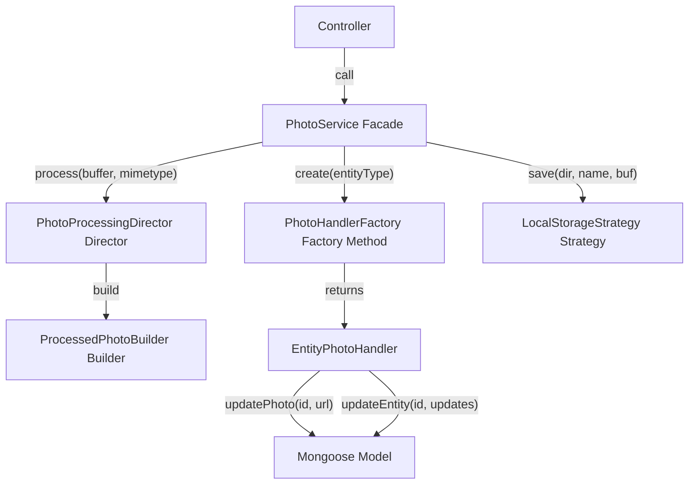

# Backend Design Patterns

This report identifies and analyses software design patterns from the
[Refactoring.Guru catalog](https://refactoring.guru/design-patterns/catalog)
that appear in the backend of this project. The backend is a Node.js / Express
5 / Mongoose / Clerk application that manages an equipment rental system.

Each pattern is classified as either **Confirmed** (a clear, textbook-like
implementation) or **Partial** (the spirit is present, but some elements differ
from the canonical form). For partial matches the report describes what is
missing and what would be required to elevate the code to a full
implementation.

---

## Pattern Summary

| # | Pattern | Category | Status | Key Files |
|---|---------|----------|--------|-----------|
| 1 | [Singleton](#1-singleton) | Creational | Confirmed | `server.js`, `models/*.js`, `config/db.js`, `services/auth/ClerkAuthAdapter.js`, `services/photo/PhotoService.js` |
| 2 | [Facade](#2-facade) | Structural | Confirmed | `server.js`, `controllers/assetController.js`, `services/photo/PhotoService.js` |
| 3 | [Adapter](#3-adapter) | Structural | Confirmed | `services/auth/AuthAdapter.js`, `services/auth/ClerkAuthAdapter.js`, `models/*.js` |
| 4 | [Decorator](#4-decorator) | Structural | Confirmed | `services/auth/ClerkAuthAdapter.js`, `routes/*.js`, `server.js` |
| 5 | [Chain of Responsibility](#5-chain-of-responsibility) | Behavioral | Confirmed | `services/auth/ClerkAuthAdapter.js`, `routes/*.js`, `services/errors/AppError.js`, `middleware/uploadMiddleware.js`, `server.js` |
| 6 | [Template Method](#6-template-method) | Behavioral | Confirmed | `services/asset-states/AssetState.js`, `services/inventory/InventoryComponent.js` |
| 7 | [State](#7-state) | Behavioral | Confirmed | `services/asset-states/*.js` |
| 8 | [Strategy](#8-strategy) | Behavioral | Confirmed | `services/asset-states/TransitionAuthoriser.js`, `services/photo/storage/*.js` |
| 9 | [Composite](#9-composite) | Structural | Confirmed | `services/inventory/*.js` |
| 10 | [Factory Method](#10-factory-method) | Creational | Confirmed | `services/photo/handlers/*.js` |
| 11 | [Builder](#11-builder) | Creational | Confirmed | `services/photo/ProcessedPhotoBuilder.js`, `services/photo/PhotoProcessingDirector.js` |

---

## 1. Singleton

**Category:** Creational

**Refactoring.Guru definition:**
> Singleton is a creational design pattern that lets you ensure that a class
> has only one instance, while providing a global access point to this instance.

### How it appears in this codebase

Node.js modules are singletons by default. When a module is `require()`'d for
the first time its top-level code runs once; the result is cached and the same
object is returned on every subsequent `require()`. The backend relies on this
mechanism in several places.

#### 1a. The Express application (`server.js`)

```js
const app = express();
```

`app` is created once at module scope. Every other module that does
`require('../server')` (e.g. the test suite) receives the exact same Express
instance. The module uses a `require.main === module` guard so the server only
starts listening when run directly, not when imported by tests.

#### 1b. Mongoose models (`models/*.js`)

```js
module.exports = mongoose.model('Asset', assetSchema);
```

`mongoose.model()` registers the model name on the global Mongoose connection.
Subsequent calls with the same name return the existing compiled model. Each
model file is evaluated only once by Node's module cache, so every controller
that does `require('../models/Asset')` receives the same model constructor.

This applies to all four models:

- `models/Asset.js` — `Asset`
- `models/AssetType.js` — `AssetType`
- `models/ProductGroup.js` — `ProductGroup`
- `models/User.js` — `User`

#### 1c. The database connection (`config/db.js`)

The `connectDB` function is created once and shared across `server.js` and the
test setup. The underlying Mongoose connection it establishes is also a
singleton — Mongoose maintains a single default connection object.

#### 1d. The auth adapter (`services/auth/ClerkAuthAdapter.js`)

```js
module.exports = new ClerkAuthAdapter();
```

The authentication adapter is exported as a singleton instance. Every file that
does `require('../services/auth/ClerkAuthAdapter')` receives the exact same
object — controllers, route files, and `server.js` all share one adapter.

#### 1e. State singletons (`services/asset-states/AssetStateMachine.js`)

```js
const STATE_MAP = {
  'Available':       new AvailableState(),
  'Pending Rental':  new PendingRentalState(),
  'Rented':          new RentedState(),
  'Pending Return':  new PendingReturnState(),
  'Maintenance':     new MaintenanceState(),
};
```

The five concrete state objects are instantiated once inside `AssetStateMachine`
and shared across all requests.

#### 1f. The photo service (`services/photo/PhotoService.js`)

```js
module.exports = new PhotoService();
```

The PhotoService is exported as a singleton instance (same pattern as
`ClerkAuthAdapter`). Every module that does `require('../services/photo/PhotoService')`
receives the same object — controllers, route files, and the Composite delete
method all share one `PhotoService` (and therefore one `StorageStrategy`).

### Evaluation

Confirmed. The Singleton is achieved through Node.js module caching rather than
the classic private-constructor + `getInstance()` pattern. This is the idiomatic
approach in JavaScript and is fully consistent with the Singleton intent: one
shared instance with a global access point.

---

## 2. Facade

**Category:** Structural

**Refactoring.Guru definition:**
> Facade is a structural design pattern that provides a simplified interface to
> a library, a framework, or any other complex set of classes.

### How it appears in this codebase

#### 2a. Application entry point (`server.js`)

`server.js` acts as a facade for the entire backend subsystem. In approximately
35 lines it wires together:

- Environment configuration (`dotenv`)
- Database connection (`config/db.js`)
- Authentication middleware (`@clerk/express`)
- CORS policy
- JSON body parsing
- Four route modules (`authRoutes`, `groupRoutes`, `typeRoutes`, `assetRoutes`)

```js
app.use(auth.contextMiddleware());
app.use(cors());
app.use(express.json());
app.use('/api/auth',   require('./routes/authRoutes'));
app.use('/api/groups', require('./routes/groupRoutes'));
app.use('/api/types',  require('./routes/typeRoutes'));
app.use('/api/assets', require('./routes/assetRoutes'));
```

Any external consumer (e.g. the test suite via `supertest`, or Nginx via the
reverse proxy) only needs to `require('./server')` to get a fully configured
application. All internal complexity — middleware ordering, route mounting,
database initialisation — is hidden behind this single file.

#### 2b. Clerk user enrichment (`controllers/assetController.js`)

The `enrichWithClerkUsers` helper function is a facade over user enrichment:

1. Extracts unique `rentedByUserId` values from raw Mongoose documents.
2. Delegates to `auth.getUsers()` (the auth adapter) for batch user lookup.
3. Receives already-normalised `{ email, name }` objects — no Clerk-specific
   field parsing is needed.
4. Merges the user data back into plain JavaScript objects.

Controller functions simply call `await enrichWithClerkUsers(assets)` without
knowing anything about the underlying auth provider, its API, or its data
format.

#### 2c. Photo service (`services/photo/PhotoService.js`)

The `PhotoService` is a facade over the entire photo subsystem. It exposes four
methods — `uploadPhoto()`, `deletePhoto()`, `getPhotoUrl()`, and `updateEntity()` — and hides behind
them the complexity of:

- **Storage strategy** — file system operations (save/delete/getUrl)
- **Image processing** — resizing and thumbnail generation via `sharp`
- **Entity handlers** — Mongoose model queries for each entity type

Controllers call `photoService.uploadPhoto('group', id, req.file)` or
`photoService.updateEntity('group', id, { name, description })` without
knowing how files are stored, how images are processed, which Mongoose model
is being updated, or how entity name/description updates are routed to the
correct handler.

### Evaluation

Confirmed. Three independent facades coexist: `server.js` (infrastructure),
`enrichWithClerkUsers` (user data), and `PhotoService` (photo operations). Each
hides a different subsystem behind a simple interface.

---

## 3. Adapter

**Category:** Structural

**Refactoring.Guru definition:**
> Adapter is a structural design pattern that allows objects with incompatible
> interfaces to collaborate.

### How it appears in this codebase

#### 3a. Mongoose `toJSON` transforms

Each model defines a `toJSON` schema option that adapts Mongoose's internal
document representation (which uses `_id`, `__v`, and `ObjectId` objects) into
the clean JSON format expected by the frontend.

```js
assetSchema.set('toJSON', {
  transform: (_, ret) => {
    ret.id     = ret._id.toString();
    ret.typeId = ret.typeId.toString();
    delete ret._id;
    delete ret.__v;
    return ret;
  },
});
```

The same pattern appears in `AssetType.js` and `ProductGroup.js`. Without these
adapters, the frontend would receive raw `ObjectId` objects and MongoDB-internal
fields. Fields like `name` and the newly-added `description` pass through
unchanged because they are plain strings.

#### 3b. Auth adapter (`services/auth/`)

The `ClerkAuthAdapter` is a comprehensive Adapter over the Clerk authentication
provider. `AuthAdapter` defines the target interface; `ClerkAuthAdapter`
implements it for Clerk:

```js
class AuthAdapter {
  contextMiddleware() { throw new Error('Not implemented'); }
  requireAuth()       { throw new Error('Not implemented'); }
  adminOnly()         { throw new Error('Not implemented'); }
  getUserId(req)      { throw new Error('Not implemented'); }
  async getUser(id)   { throw new Error('Not implemented'); }
  async getUsers(ids) { throw new Error('Not implemented'); }
}
```

The adapter translates three kinds of Clerk coupling:

| Clerk concern | Clerk-specific detail | Adapter method | Consumer sees |
|---------------|----------------------|----------------|---------------|
| Middleware | `clerkMiddleware()` / `requireAuth()` | `contextMiddleware()` / `requireAuth()` | Consistent calling convention |
| Request auth | `req.auth` is a function in v2, object in v1 | `getUserId(req)` | `string \| null` |
| User data | `emailAddresses[0]`, `firstName`/`lastName`, `publicMetadata.role` | `getUser()` / `getUsers()` | `{ id, email, name, role }` |

No consumer outside `ClerkAuthAdapter.js` imports from `@clerk/express`.
Replacing Clerk with Auth0, Firebase Auth, or any other provider requires only
a new adapter class — zero changes to controllers, routes, or business logic.

### Files

| File | Role |
|------|------|
| `services/auth/AuthAdapter.js` | Base class — defines the adapter interface |
| `services/auth/ClerkAuthAdapter.js` | Concrete adapter — translates Clerk API calls |

### Evaluation

Confirmed. Textbook Adapter implementations. The `toJSON` transforms run
automatically on every serialisation. The `ClerkAuthAdapter` absorbs all
Clerk-specific code into a single file — all other modules import the adapter
singleton and never see Clerk internals.

---

## 4. Decorator

**Category:** Structural

**Refactoring.Guru definition:**
> Decorator is a structural design pattern that lets you attach new behaviors to
> objects by placing these objects inside special wrapper objects that contain
> the behaviors.

### How it appears in this codebase

Express middleware is a classic implementation of the Decorator pattern. Each
middleware function wraps the request/response cycle and adds behaviour without
changing the core handler's interface (the `(req, res, next)` signature).

#### 4a. Application-level decorators (`server.js`)

```js
app.use(auth.contextMiddleware());  // decorates every request with auth context
app.use(cors());                    // decorates every response with CORS headers
app.use(express.json());            // decorates every request with parsed JSON body
```

Each `app.use()` call adds a decorator to the request pipeline. The decorators
are composable and can be reordered independently.

#### 4b. Route-level decorators (`routes/*.js`)

```js
router.post('/', auth.requireAuth(), auth.adminOnly(), createAsset);
```

Here the base handler (`createAsset`) is decorated with two additional
behaviours:

1. **`auth.requireAuth()`** — verifies the user is authenticated via the auth
   provider. If not, responds with `401` and stops the chain.
2. **`auth.adminOnly()`** — checks `user.role === 'admin'`. If not, responds
   with `403` and stops the chain.

Only after both decorators pass does the request reach the actual controller.
This pattern repeats across all route files.

### Evaluation

Confirmed. Express middleware is one of the most widely recognised real-world
uses of the Decorator pattern in the JavaScript ecosystem. Each decorator has a
single responsibility (authentication, authorisation, CORS, body parsing) and
they compose naturally through the middleware stack.

---

## 5. Chain of Responsibility

**Category:** Behavioral

**Refactoring.Guru definition:**
> Chain of Responsibility is a behavioral design pattern that lets you pass
> requests along a chain of handlers. Upon receiving a request, each handler
> decides either to process the request or to pass it to the next handler in
> the chain.

### How it appears in this codebase

Express middleware also implements the Chain of Responsibility pattern. Each
handler receives the request, performs its work, and calls `next()` to pass
control to the next handler. A handler can **short-circuit** the chain by
sending a response instead of calling `next()`.

#### 5a. The `adminOnly` handler (`services/auth/ClerkAuthAdapter.js`)

```js
adminOnly() {
  return async (req, res, next) => {
    try {
      const user = await this.getUser(this.getUserId(req));
      if (user.role !== 'admin') {
        return res.status(403).json({ message: 'Admin access required' });
      }
      next();
    } catch (err) {
      res.status(403).json({ message: 'Admin access required' });
    }
  };
}
```

This is a textbook Chain of Responsibility handler:

- It checks a condition (is the user an admin?).
- If the condition fails, it **handles the request itself** by responding with
  `403` — the chain stops.
- If the condition passes, it calls `next()` to **pass the request along** to
  the next handler.

#### 5b. Per-route handler chains

```js
router.post('/', auth.requireAuth(), auth.adminOnly(), createAsset);
```

The chain for this route is:

```
auth.requireAuth() → auth.adminOnly() → createAsset
```

1. `auth.requireAuth()` checks authentication. Unauthenticated → `401`, chain
   stops.
2. `auth.adminOnly()` checks authorisation. Non-admin → `403`, chain stops.
3. `createAsset` is the terminal handler — it processes the business logic.

#### 5c. Error hierarchy as an extension of the chain (`services/errors/AppError.js`)

The custom error class hierarchy (`AppError`, `ValidationError`, `NotFoundError`,
`AuthorisationError`, `AuthenticationError`) extends the Chain of Responsibility
by enriching the terminal error handler in `server.js`.

Each error class carries its own `statusCode`:

```js
class AppError extends Error {
  constructor(message, statusCode = 500) {
    super(message);
    this.statusCode = statusCode;
  }
}
class ValidationError    extends AppError { constructor(m) { super(m, 400); } }
class NotFoundError       extends AppError { constructor(m) { super(m, 404); } }
class AuthorisationError  extends AppError { constructor(m) { super(m, 403); } }
class AuthenticationError extends AppError { constructor(m) { super(m, 401); } }
```

Controllers throw typed errors (`throw new NotFoundError('Asset not found')`)
instead of calling `res.status(404).json(...)`. Express 5 catches the thrown
error and passes it to the global error-handling middleware — the **terminal
handler** in the chain:

```js
app.use((err, req, res, next) => {
  const status = err instanceof AppError ? err.statusCode : 500;
  const message = status < 500 ? err.message : 'Internal server error';
  res.status(status).json({ message });
});
```

Key design decisions:

- **AppError subclasses** (400/401/403/404): the message is user-facing and
  shown to the client.
- **Unexpected errors** (500): the raw message is hidden and replaced with
  "Internal server error" to prevent information leakage (stack traces, DB
  connection strings, etc.).
- **Non-AppError throws** (e.g. Mongoose validation, network errors): treated
  as 500, message hidden — same safety guarantee.

This pattern separates HTTP concerns from business logic. Controllers express
error conditions declaratively (`throw new NotFoundError(...)`) and the global
handler translates error types into HTTP responses in one place.

Adding `PATCH /:id` routes for entity name/description updates extends the
same chain pattern — the new routes follow the identical `auth.requireAuth()`,
`auth.adminOnly()` sequence before reaching the controller:

```js
router.patch('/:id', auth.requireAuth(), auth.adminOnly(), updateEntity('group'));
```

The full chain for an entity update:

```
auth.requireAuth() → auth.adminOnly() → updateEntity
```

1. `auth.requireAuth()` — checks authentication (401 if unauthenticated).
2. `auth.adminOnly()` — checks admin role (403 if not admin).
3. `updateEntity('group')` — the terminal handler: validates input and updates
   the entity via PhotoService.

All three entity types (groups, types, assets) share the same chain structure,
differing only in the entity type string passed to the controller factory.

#### 5d. Upload validation chain (`middleware/uploadMiddleware.js`)

Photo upload routes add two new links to the middleware chain:

```js
router.post('/:id/photo', auth.requireAuth(), auth.adminOnly(),
            upload.single('photo'), validateFileType, uploadPhoto('group'));
```

The full chain for a photo upload:

```
auth.requireAuth() → auth.adminOnly() → multer.single('photo') → validateFileType → uploadPhoto
```

1. `auth.requireAuth()` — checks authentication (401 if unauthenticated).
2. `auth.adminOnly()` — checks admin role (403 if not admin).
3. `multer.single('photo')` — parses multipart data; enforces 5MB file size
   limit. Multer errors (e.g. file too large) are caught by Express 5 and
   forwarded to the global error handler.
4. `validateFileType` — checks MIME type is `image/jpeg`, `image/png`, or
   `image/webp`. Throws `ValidationError` (400) if not. This matches the project
   convention of throwing typed `AppError` subclasses rather than calling
   `res.status().json()` directly.
5. `uploadPhoto('group')` — the terminal handler: processes and saves the photo.

### Relationship to Decorator

Express middleware simultaneously implements both Decorator and Chain of
Responsibility. The distinction depends on perspective:

- As a **Decorator**, each middleware *adds* behaviour (auth context, CORS
  headers, parsed bodies) while preserving the `(req, res, next)` interface.
- As a **Chain of Responsibility**, each middleware *decides* whether to handle
  the request or pass it along. The `auth.adminOnly()` middleware is a
  particularly clear example because it explicitly short-circuits the chain.

### Evaluation

Confirmed. The pattern is used consistently across all route definitions, and
the separation between authentication (`auth.requireAuth()`) and authorisation
(`auth.adminOnly()`) into distinct chain links follows best practice.

---

## 6. Template Method

**Category:** Behavioral

**Refactoring.Guru definition:**
> Template Method is a behavioral design pattern that defines the skeleton of
> an algorithm in the superclass but lets subclasses override specific steps of
> the algorithm without changing its structure.

### How it appears in this codebase

#### 6a. `AssetState` base class (`services/asset-states/AssetState.js`)

The `AssetState` base class defines the `canTransitionTo()` algorithm skeleton:

```js
class AssetState {
  getName()                              { throw new Error('Not implemented'); }
  getValidTransitions()                  { return []; }
  canTransitionTo(newStatus)             { return this.getValidTransitions().includes(newStatus); }
  shouldClearRentalData(_newStatus)      { return false; }
}
```

`canTransitionTo()` is the **template method** — it defines the algorithm
structure (check if the target status is in the list of valid transitions) and
calls the **primitive operation** `getValidTransitions()`, which each concrete
state class overrides:

| State class | `getValidTransitions()` override |
|---|---|
| `AvailableState` | `['Pending Rental', 'Maintenance']` |
| `PendingRentalState` | `['Rented', 'Available']` |
| `RentedState` | `['Pending Return', 'Maintenance']` |
| `PendingReturnState` | `['Available', 'Rented', 'Maintenance']` |
| `MaintenanceState` | `['Available']` |

Similarly, `shouldClearRentalData()` defaults to `false` in the base class, but
`PendingRentalState` and `PendingReturnState` override it to return `true` for
specific transitions — another primitive operation in the template.

#### 6b. `InventoryComponent` base class (`services/inventory/InventoryComponent.js`)

The `InventoryComponent` base class now provides Template Methods for the two
core Composite operations:

```js
class InventoryComponent {
  getId()                   { throw new Error('Not implemented'); }
  getName()                 { throw new Error('Not implemented'); }
  getChildren()             { return []; }        // leaf-safe default

  // Helper: collect own photo paths (shared by all subclasses)
  _collectOwnPhotoPaths()   { /* imageUrl + thumbnailUrl */ }

  // Helper: delete own photos via storage strategy
  async _deleteOwnPhotos(storageStrategy) { /* ... */ }

  // Template Method: collect own photos, then recurse into children
  getPhotoPaths() { /* calls _collectOwnPhotoPaths → recurses via getChildren() */ }

  // Template Method: delete children first (bottom-up), then own photos, then self
  async delete(storageStrategy) { /* recurses via getChildren() → _deleteOwnPhotos → _deleteSelf */ }

  // Primitive operation: subclasses override to call their model's findByIdAndDelete
  async _deleteSelf()        { throw new Error('Not implemented'); }
}
```

`getPhotoPaths()` and `delete()` are **Template Methods** — they define the
algorithm skeleton (collect own data → recurse into children for composites,
skip for leaves) and call the primitive operations `getChildren()` and
`_deleteSelf()`. Each concrete subclass overrides only `_deleteSelf()`:

| Subclass | `_deleteSelf()` override |
|---|---|
| `ProductGroupComponent` | `ProductGroup.findByIdAndDelete(this.doc._id)` |
| `AssetTypeComponent` | `AssetType.findByIdAndDelete(this.doc._id)` |
| `AssetComponent` | `Asset.findByIdAndDelete(this.doc._id)` |

The three subclasses previously each had ~30 lines of duplicated `getPhotoPaths()`
and `delete()` code. The Template Method refactor eliminated that duplication by
moving the common algorithm into the base class, leaving each subclass with only
~6 lines of unique code (constructor + accessors + `_deleteSelf()`).

Similarly, `getChildren()` returns an empty array by default, so `AssetComponent`
(the leaf) inherits the full Template Method behaviour without overriding
anything. The leaf's `getPhotoPaths()` collects only its own photos (empty
children loop), and `delete()` skips the children loop and goes straight to
photo cleanup and self-deletion — correct leaf behaviour by default.

### Evaluation

Confirmed. Both `AssetState.canTransitionTo()` and `InventoryComponent.getPhotoPaths()` /
`InventoryComponent.delete()` are textbook Template Methods: the algorithm skeleton
lives in the superclass and subclasses provide the varying step via
`getValidTransitions()` and `_deleteSelf()` respectively. The refactor eliminated
~50 lines of duplicated code across the three Composite subclasses.

---

## 7. State

**Category:** Behavioral

**Refactoring.Guru definition:**
> State is a behavioral design pattern that lets an object alter its behavior
> when its internal state changes. It appears as if the object changed its
> class.

### How it appears in this codebase

The State pattern is implemented with one class per asset status, a context
class that delegates to the current state, and singletons for each state object.

#### 7a. The State interface (`AssetState`)

The base class defines the State contract (see [§6a](#6a-assetstate-base-class)):
`getName()`, `getValidTransitions()`, `canTransitionTo()`, and
`shouldClearRentalData()`.

#### 7b. Concrete State classes (five)

| File | Class | Valid transitions from this state |
|------|-------|----------------------------------|
| `AvailableState.js` | `AvailableState` | → Pending Rental, Maintenance |
| `PendingRentalState.js` | `PendingRentalState` | → Rented, Available |
| `RentedState.js` | `RentedState` | → Pending Return, Maintenance |
| `PendingReturnState.js` | `PendingReturnState` | → Available, Rented, Maintenance |
| `MaintenanceState.js` | `MaintenanceState` | → Available |

Each state also defines `shouldClearRentalData()` to indicate whether rental
metadata should be cleared when transitioning to a given target state. For
example, `PendingReturnState` clears rental data when transitioning to
`Available` or `Maintenance`, but not when going to `Rented`.

#### 7c. The Context (`AssetStateMachine`)

```js
class AssetStateMachine {
  constructor(currentStatus) {
    const state = STATE_MAP[currentStatus];
    if (!state) throw new Error(`Unknown status: ${currentStatus}`);
    this._state = state;
  }

  canTransitionTo(newStatus, authoriser) { /* delegates to state + authoriser */ }
  getValidTransitions()                   { return this._state.getValidTransitions(); }
  shouldClearRentalData(newStatus)        { return this._state.shouldClearRentalData(newStatus); }
}
```

The context wraps the current status string and delegates all behaviour to the
appropriate state singleton. The `STATE_MAP` (see [§1e](#1e-state-singletons-servicesasset-statesassetstatemachinejs))
maps each status string to its singleton state object.

#### 7d. State machine transitions

```
Available ────────→ Pending Rental ──→ Rented ──→ Pending Return ──→ Available
    │                      │              │              │
    └──→ Maintenance        └──→ Available └──→ Maintenance └──→ Rented
                                                                 └──→ Maintenance
                                                 Maintenance ──→ Available
```

#### 7e. Controller integration

The controller (`assetController.js`) integrates the State pattern in the
`bulkUpdateStatus` handler for two purposes:

**Transition validation:**

```js
const assets = await Asset.find({ _id: { $in: ids } });

for (const asset of assets) {
  const machine = new AssetStateMachine(asset.status);
  if (!machine.canTransitionTo(status, authoriser)) {
    throw new AuthorisationError(
      `Not authorised to transition "${asset.name}" from ${asset.status} to ${status}`
    );
  }
}
```

**Rental data clearing (state-machine-driven):**

```js
let shouldClear;
if (clearRentalData !== undefined) {
  // Client explicitly specified — use their value (backward compatible)
  shouldClear = clearRentalData === true;
} else {
  // No client preference — ask the state machine.
  // All assets share the same transition so any machine gives the same answer.
  const machine = new AssetStateMachine(assets[0].status);
  shouldClear = machine.shouldClearRentalData(status);
}
```

The `shouldClearRentalData()` method is now **wired into the controller** as a
default. If the client sends an explicit `clearRentalData` flag, that value
takes precedence. Otherwise, the state machine's encapsulated knowledge of
transition side effects determines whether rental data is cleared. For example,
`PendingReturnState → Available` automatically clears `rentedByUserId` and
`returnDate` without the client needing to specify it.

### Why State

Before this refactoring, asset status management used a string enum and inline
conditional logic in the controller. There was **no validation of valid
transitions** — an asset could be set from any status to any other status.

The State pattern replaces that with:

1. **One class per state** — each knows what transitions are valid from itself.
2. **Context delegation** — `AssetStateMachine` wraps the status and delegates.
3. **Self-documenting** — the full lifecycle is visible from the class
   hierarchy alone.
4. **Encapsulated side effects** — states define when rental data should be
   cleared.

### Evaluation

Confirmed. The implementation satisfies all three textbook requirements:

1. **State interface** (`AssetState`) declaring state-specific methods.
2. **Concrete State classes** (five) implementing state-specific behaviour.
3. **Context** (`AssetStateMachine`) holding a reference to the current state
   and delegating behaviour to it.

---

## 8. Strategy

**Category:** Behavioral

**Refactoring.Guru definition:**
> Strategy is a behavioral design pattern that lets you define a family of
> algorithms, put each of them into a separate class, and make their objects
> interchangeable.

### How it appears in this codebase

#### 8a. The Strategy interface (`TransitionAuthoriser`)

```js
class TransitionAuthoriser {
  canTransition(fromStatus, toStatus) { throw new Error('Not implemented'); }
  verifyOwnership(asset, userId)      { throw new Error('Not implemented'); }
}
```

#### 8b. Concrete strategies

| Class | `canTransition()` | `verifyOwnership()` |
|-------|-------------------|---------------------|
| `AdminAuthoriser` | Always `true` | Always `true` |
| `CustomerAuthoriser` | `true` only for `Rented` and `Pending Return` | `true` only if `asset.rentedByUserId === userId` |

#### 8c. Runtime selection

The controller selects an authorisation strategy at runtime based on the user's
role:

```js
const authoriser = isAdmin ? new AdminAuthoriser() : new CustomerAuthoriser();
```

Then calls the uniform interface:

```js
if (!machine.canTransitionTo(status, authoriser)) { /* reject */ }
if (!authoriser.verifyOwnership(asset, userId))   { /* reject */ }
```

Adding a future role (e.g. "manager") means creating one new class — no
controller or state class changes needed.

### Relationship with State

The Strategy and State patterns work together in a three-phase validation:

1. **State** (structural): "Is Available → Rented a valid transition?" → No.
   Reject.
2. **Strategy** (authorisational): "Does this user's role permit setting
   Maintenance?" → Customer: No. Reject.
3. **Strategy** (ownership): "Does this user own the asset?" → Customer, wrong
   user: No. Reject.

All three must pass for the transition to be permitted.

#### 8d. Photo storage strategy (`services/photo/storage/*.js`)

A second, independent Strategy instance handles file storage for photos:

```js
// Strategy interface
class StorageStrategy {
  async save(directory, filename, buffer) { throw new Error('Not implemented'); }
  async delete(relativePath)              { throw new Error('Not implemented'); }
  getUrl(relativePath)                    { throw new Error('Not implemented'); }
}
```

| Class | `save()` | `delete()` | `getUrl()` |
|-------|----------|------------|------------|
| `LocalStorageStrategy` | Writes to `backend/uploads/<dir>/<file>` | Deletes from local filesystem | Returns URL path unchanged |

The `PhotoService` (Facade) holds a reference to a `StorageStrategy` instance
and delegates all file I/O through it. The strategy is selected once at
construction time based on environment config (currently always `LocalStorageStrategy`,
but could be swapped for S3 or Cloudinary without changing any business logic).

The same `StorageStrategy` instance is also passed to the Composite's
`delete(storageStrategy)` method. The `InventoryComponent._deleteOwnPhotos()`
helper calls `storageStrategy.delete(url)` for each photo file — the Composite
doesn't know or care which backend it's deleting from.

In tests, a mock strategy can be substituted to avoid filesystem side-effects.

### Evaluation

Confirmed. Two independent Strategy pattern instances coexist in the codebase:
`TransitionAuthoriser` for state transitions and `StorageStrategy` for file
storage. Both follow the textbook structure: a family of interchangeable
algorithms behind a common interface, selected at runtime by the client.

---

## 9. Composite

**Category:** Structural

**Refactoring.Guru definition:**
> Composite is a structural design pattern that lets you compose objects into
> tree structures and then work with these structures as if they were individual
> objects.

### How it appears in this codebase

The Composite pattern is implemented as wrapper classes that sit alongside the
Mongoose models, providing a uniform interface over the three-level entity
hierarchy:

```
ProductGroupComponent  →  AssetTypeComponent  →  AssetComponent
    (composite)               (composite)           (leaf)
```

#### 9a. The Component interface (`InventoryComponent`)

All three entity wrappers implement the same interface:

```js
class InventoryComponent {
  getId()                          // → string
  getName()                        // → string
  getChildren()                    // → InventoryComponent[] (empty for leaves)
  getPhotoPaths()                  // → string[]
  async delete(storageStrategy)    // deletes this entity and all descendants
}
```

#### 9b. The leaf: `AssetComponent`

```js
class AssetComponent extends InventoryComponent {
  getChildren() { return []; }  // leaf: no children

  async delete(storageStrategy) {
    if (storageStrategy) {
      if (this.doc.imageUrl)     await storageStrategy.delete(this.doc.imageUrl);
      if (this.doc.thumbnailUrl) await storageStrategy.delete(this.doc.thumbnailUrl);
    }
    await Asset.findByIdAndDelete(this.doc._id);
  }
}
```

#### 9c. The composites: `AssetTypeComponent` and `ProductGroupComponent`

Both hold arrays of child `InventoryComponent` objects and delegate
operations recursively:

```js
class AssetTypeComponent extends InventoryComponent {
  getChildren() { return this.children; }

  getPhotoPaths() {
    const paths = [];
    if (this.doc.imageUrl)     paths.push(this.doc.imageUrl);
    if (this.doc.thumbnailUrl) paths.push(this.doc.thumbnailUrl);
    for (const child of this.children) paths.push(...child.getPhotoPaths());
    return paths;
  }

  async delete(storageStrategy) {
    for (const child of this.children) await child.delete(storageStrategy);  // recurse first
    if (storageStrategy) {
      if (this.doc.imageUrl)     await storageStrategy.delete(this.doc.imageUrl);
      if (this.doc.thumbnailUrl) await storageStrategy.delete(this.doc.thumbnailUrl);
    }
    await AssetType.findByIdAndDelete(this.doc._id);
  }
}
```

#### 9d. The tree builder (`InventoryTreeBuilder`)

A stateless factory class assembles composite trees from MongoDB:

```js
class InventoryTreeBuilder {
  static async fromGroupId(groupId)  → ProductGroupComponent  // full subtree
  static async fromTypeId(typeId)    → AssetTypeComponent      // full subtree
  static async fromAssetId(assetId)  → AssetComponent          // leaf only
}
```

#### 9e. Client code — the controllers

All three delete handlers follow the **same** pattern:

```js
const root = await InventoryTreeBuilder.fromGroupId(req.params.id);
if (!root) return res.status(404).json({ message: 'Group not found' });
await root.delete(null);
res.json({ success: true });
```

Client code treats all levels uniformly — `build tree → call delete()` — with
no knowledge of the tree depth or composition.

### Evaluation

Confirmed. The implementation satisfies all four textbook requirements:

1. **Common `InventoryComponent` interface** declared in the base class and
   implemented by all three subclasses.
2. **`AssetComponent` is a leaf** — `getChildren()` returns `[]`.
3. **`AssetTypeComponent` and `ProductGroupComponent` are composites** — they
   hold arrays of child `InventoryComponent` objects.
4. **Operations delegate recursively** — `getPhotoPaths()` and `delete()`
   cascade through the entire subtree.

---

## 10. Factory Method

**Category:** Creational

**Refactoring.Guru definition:**
> Factory Method is a creational design pattern that provides an interface for
> creating objects in a superclass, but allows subclasses to alter the type of
> objects that will be created.

### How it appears in this codebase

#### 10a. Entity photo handlers (`services/photo/handlers/*.js`)

The photo subsystem introduces a textbook Factory Method structure:

```js
// Creator (base class)
class EntityPhotoHandler {
  get model()          { throw new Error('Not implemented'); }
  get subdirectory()   { throw new Error('Not implemented'); }
  async findById(id)   { return this.model.findById(id); }
  async updatePhoto(id, imageUrl, thumbnailUrl) { /* ... */ }
  async getPhotoPaths(id) { /* ... */ }
  async deleteEntityPhotoFiles(id, storageStrategy) { /* ... */ }
  async updateEntity(id, updates) { /* finds doc, applies partial update, saves */ }
}
```

Three concrete subclasses override only the `model` and `subdirectory` getters:

|| Subclass | `model` | `subdirectory` | File |
||---|---------|---------------|------|
|| `GroupPhotoHandler` | `ProductGroup` | `'groups'` | `handlers/GroupPhotoHandler.js` |
|| `TypePhotoHandler` | `AssetType` | `'types'` | `handlers/TypePhotoHandler.js` |
|| `AssetPhotoHandler` | `Asset` | `'assets'` | `handlers/AssetPhotoHandler.js` |

The factory (`PhotoHandlerFactory`) creates the correct handler based on a type
string:

```js
class PhotoHandlerFactory {
  static create(entityType: 'group' | 'type' | 'asset') {
    switch (entityType) {
      case 'group': return new GroupPhotoHandler();
      case 'type':  return new TypePhotoHandler();
      case 'asset': return new AssetPhotoHandler();
    }
  }
}
```

Client code (the `PhotoService` facade) works through the base `EntityPhotoHandler`
interface without knowing which concrete handler it received:

```js
const handler = PhotoHandlerFactory.create(entityType);
await handler.deleteEntityPhotoFiles(entityId, this.storageStrategy);
await handler.updatePhoto(entityId, imageUrl, thumbnailUrl);
await handler.updateEntity(entityId, { name, description });
```

### Factory Method structure

This satisfies all three textbook requirements:

1. A **Creator** class (`EntityPhotoHandler`) with a common interface.
2. **Concrete Creators** (three subclasses) that vary the model, directory, and
   query logic.
3. Client code (`PhotoService`) works with products through the base interface,
   not knowing which concrete class it received.

### Why this upgrades Factory Method from Partial to Confirmed

The previous analysis (§10 in the original report) noted that the codebase had
no creator subclasses or polymorphic product interfaces — it was rated Partial.
The photo handlers introduce all three canonical Factory Method elements:
creator base class, concrete subclasses with varying behaviour, and a factory
that selects the right subclass at runtime.

---

## 11. Builder

**Category:** Creational

**Refactoring.Guru definition:**
> Builder is a creational design pattern that lets you construct complex
> objects step by step.

### How it appears in this codebase

Photo processing involves multiple ordered steps (set original, resize, generate
thumbnail, build result). The Builder pattern captures this multi-step
construction, and a Director defines the standard processing sequence.

#### 11a. The Builder (`ProcessedPhotoBuilder`)

```js
class ProcessedPhotoBuilder {
  setOriginal(buffer, mimetype)   // stores raw upload data
  async resize(maxWidth, maxHeight)   // resizes with sharp
  async generateThumbnail(size)       // creates square thumbnail
  async getResult()                   // returns { originalBuffer, thumbnailBuffer, width, height, mimetype }
}
```

Each step is isolated and testable independently. The builder accumulates state
through method calls and produces the final product via `getResult()`.

#### 11b. The Director (`PhotoProcessingDirector`)

```js
class PhotoProcessingDirector {
  async process(fileBuffer, mimetype) {
    const builder = new ProcessedPhotoBuilder();
    builder.setOriginal(fileBuffer, mimetype);
    await builder.resize(800, 800);
    await builder.generateThumbnail(200);
    return builder.getResult();
  }
}
```

The Director knows the **order** of steps (resize to 800×800, then 200×200
thumbnail) but doesn't know the implementation details of each step — those are
encapsulated in the Builder.

#### 11c. Why Builder + Director

- The Builder allows future variations without changing the Director (e.g. a
  different Director could skip thumbnails for small icons).
- The Builder can be used standalone for custom processing sequences.
- Each step is isolated and testable independently.

### Product

```js
{
  originalBuffer:  <Buffer>,    // resized original
  thumbnailBuffer: <Buffer>,    // thumbnail image
  width:           800,         // final width
  height:          600,         // final height
  mimetype:        'image/jpeg',
}
```

### Evaluation

Confirmed. Textbook Builder implementation: the Builder constructs a complex
product step by step, the Director defines the standard sequence, and the
`PhotoService` (client) calls the Director without knowing the construction
details. The pattern is a clean fit for image processing pipelines where each
step (resize, thumbnail, format conversion) is a discrete operation on
accumulated state.

---

## Cross-Pattern Relationships

Several patterns coexist and interact within a single request flow:

### The `ClerkAuthAdapter` — three patterns in one module

The `ClerkAuthAdapter` simultaneously implements:

- **Adapter** — translates Clerk's API into a stable interface.
- **Facade** — simplifies the Clerk subsystem behind six methods.
- **Singleton** — one shared instance via `module.exports = new ClerkAuthAdapter()`.

### State + Strategy — three-phase validation

In `bulkUpdateStatus`, the State and Strategy patterns work together:

1. **State** checks structural validity (is the transition allowed at all?).
2. **Strategy** checks role-based authorisation (is this user's role permitted?).
3. **Strategy** checks ownership (does this user own the asset?).

### Composite + Template Method

The `delete()` method follows the same algorithm skeleton across all three
`InventoryComponent` subclasses (delete children → clean up photos → delete
self) — a structural Template Method across the Composite hierarchy.

### Error Hierarchy + Chain of Responsibility

The `AppError` class hierarchy (`services/errors/AppError.js`) extends the
Chain of Responsibility by enriching the terminal error handler. Thrown
`AppError` subclasses carry their own HTTP status code; the global error
middleware in `server.js` inspects the error type and responds accordingly.
This cleanly separates HTTP concerns (status codes) from business logic
(thrown errors).

### All patterns coexist cleanly

No pattern conflicts with another. Controllers use Adapter + Composite + State +
Strategy in a single request flow without any pattern fighting for control.

### PhotoService — multiple patterns in every operation

A single `uploadPhoto()` call coordinates five patterns; a single `updateEntity()`
call coordinates three:



1. **Facade** — `PhotoService` presents a simple 4-method interface.
2. **Factory Method** — `PhotoHandlerFactory.create()` returns the right handler.
3. **Builder** — `ProcessedPhotoBuilder` constructs the processed image step by
   step, orchestrated by `PhotoProcessingDirector` (Director).
4. **Strategy** — `LocalStorageStrategy` handles file I/O; swappable for S3 etc.
5. **Singleton** — `PhotoService` is a singleton; all modules share one storage
   strategy instance.

The `updateEntity()` method employs the Facade and Factory Method patterns
without needing the Builder or Strategy — it simply routes partial updates
through the factory-selected handler to the correct Mongoose model.

### Composite + Strategy — cascading photo cleanup

The Composite's `delete(storageStrategy)` Template Method delegates photo
deletion to the `StorageStrategy`. The Composite doesn't know about
filesystem paths, S3 buckets, or Cloudinary URLs — it calls
`storageStrategy.delete(url)` and the strategy handles the rest.

---

## Verification

| Pattern | Evidence |
|---------|----------|
| State | 30 dedicated unit tests (`test/state-pattern.test.js`). 1 integration test verifying state-machine-driven rental data clearing (`test/assets.test.js`). |
| Strategy | Virtual transition authoriser tests in `test/state-pattern.test.js`. LocalStorageStrategy verified by photo integration tests (`test/photo.test.js`). MockStrategy available for service-level testing. |
| Adapter | 20 dedicated unit tests (`test/adapter.test.js`). Correctly handles Clerk v1 and v2 request shapes, normalises user objects, and degrades gracefully on API failures. |
| Composite | 14 dedicated integration tests (`test/composite.test.js`). Template Method refactor eliminated ~50 lines of duplicated code; all 14 tests pass unchanged. Cascading photo deletion verified by integration tests. |
| Singleton | Verified by Node.js module caching — `require()` returns the same object. PhotoService follows the same pattern as ClerkAuthAdapter. |
| Facade | `server.js` (infrastructure), `enrichWithClerkUsers` (user data), and `PhotoService` (photo operations) — three independent facades. `PhotoService` verified by integration tests. |
| Decorator | Middleware stack verified by route-level integration tests. |
| Chain of Responsibility | Middleware chain verified by auth integration tests (401/403 responses). Upload validation chain (multer + validateFileType) verified by photo tests (400 for invalid file types). |
| Template Method | Verified by State pattern unit tests and Composite integration tests. |
| Factory Method | PhotoHandlerFactory.create() returns the correct handler subclass for each entity type. Verified by integration tests via PhotoService. `updateEntity()` added to the base class extends the pattern — all three subclasses inherit it without changes. |
| Builder | ProcessedPhotoBuilder and PhotoProcessingDirector verified by photo integration tests (correct resize + thumbnail dimensions). |
| Controller | `photoController.js` exports `updateEntity` as a higher-order function following the same factory pattern as `uploadPhoto` and `deletePhoto`. 12 dedicated integration tests cover all PATCH scenarios (200, 400, 404, 401, 403 for groups, types, and assets). |

---

## Note on Error Handling

Route handlers contain no explicit try/catch blocks. Express 5 automatically
catches rejected promises from `async` handlers and forwards them to
`next(err)`. A single error-handling middleware in `server.js` (the Express
standard four-parameter form: `(err, req, res, next)`) responds with a
consistent `{ message: string }` shape.

The custom `AppError` class hierarchy (`services/errors/AppError.js`) extends
this by giving each error type its own HTTP status code. Controllers throw
typed errors (`throw new NotFoundError('Asset not found')`) instead of calling
`res.status(404).json(...)`, keeping HTTP concerns in one place — the global
error handler. Unexpected errors (those not extending `AppError`) default to
500 and hide their message to prevent information leakage.
